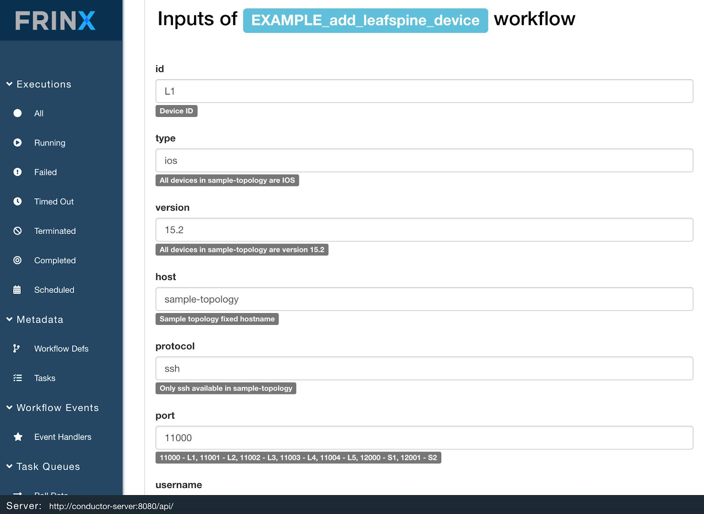
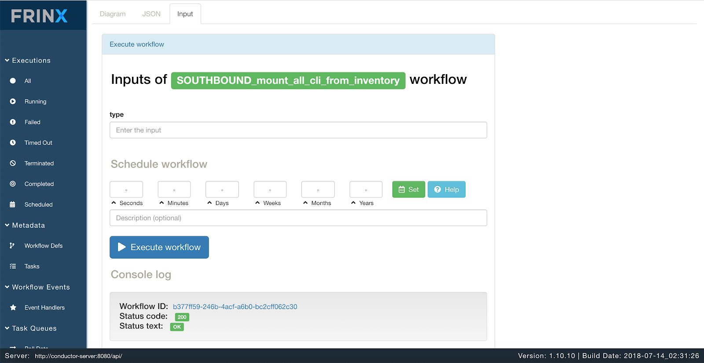
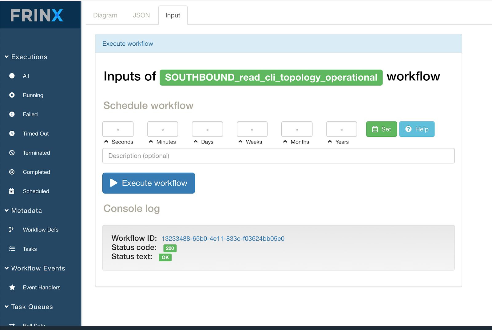
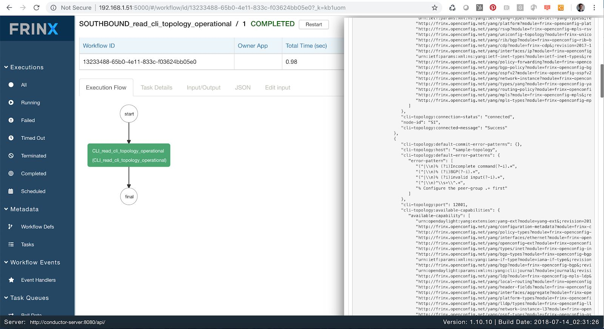
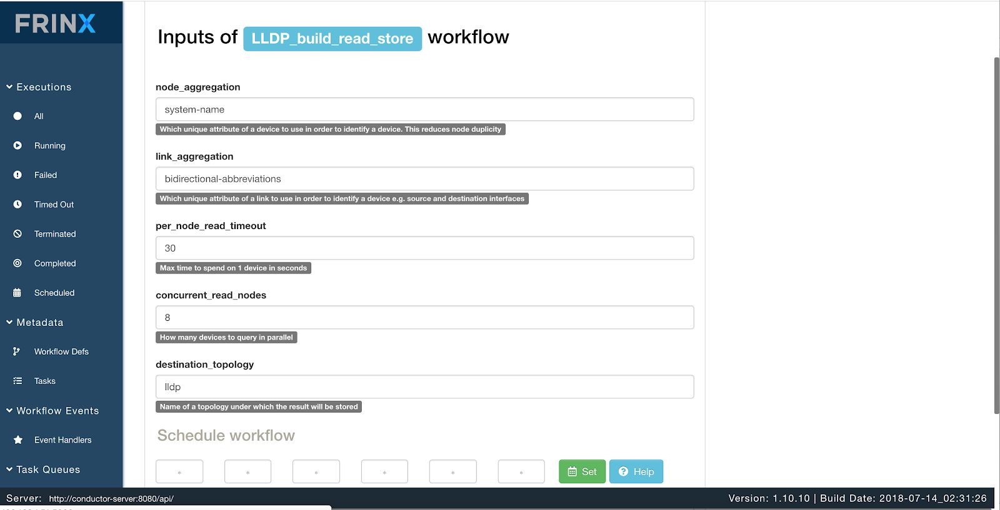
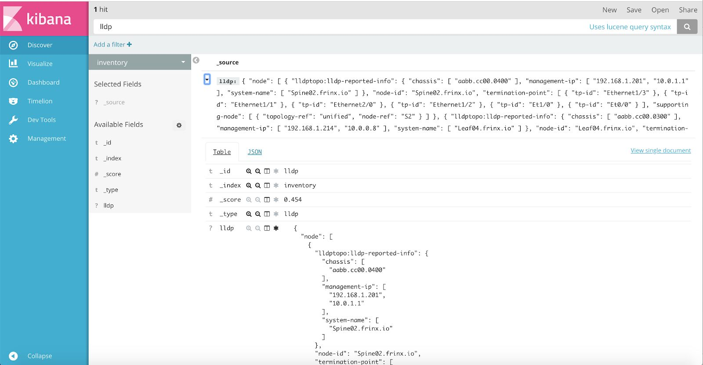
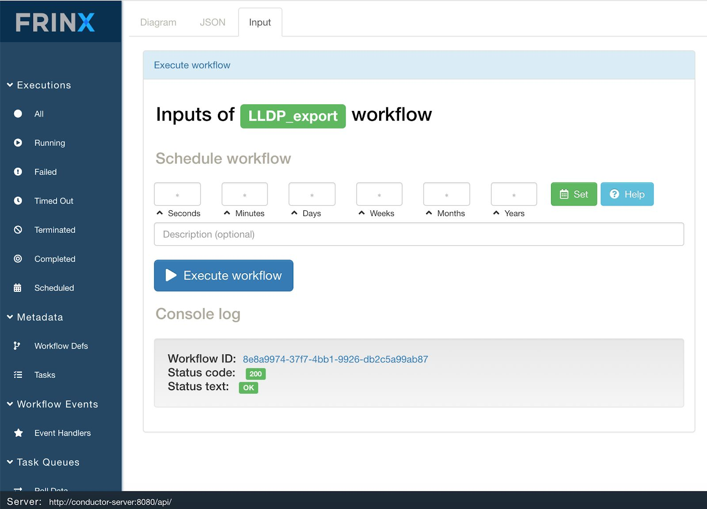
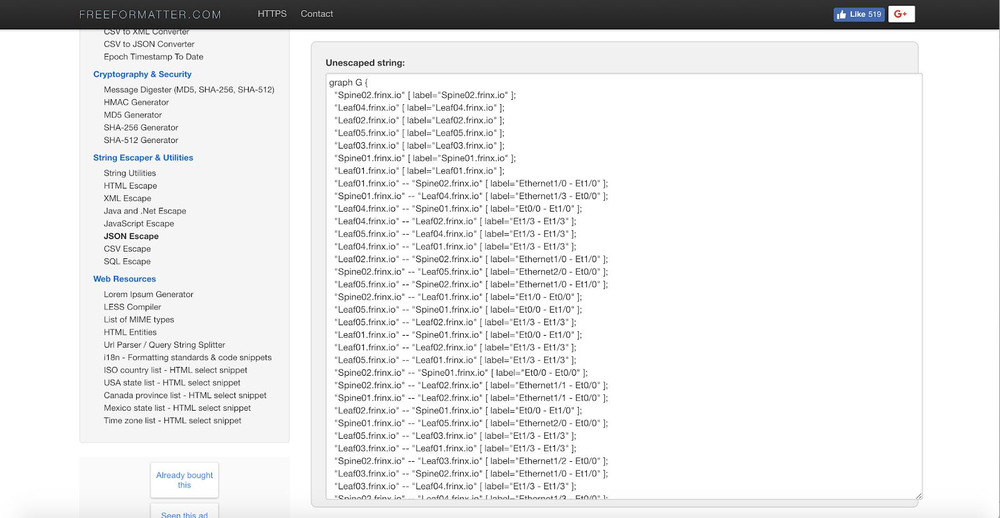
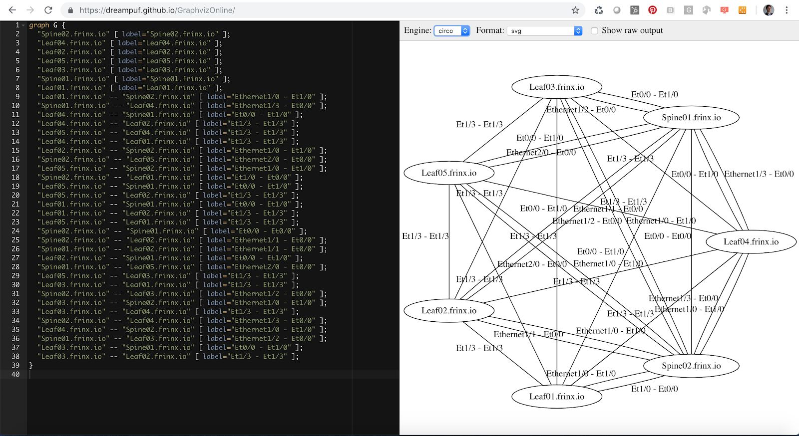

## Running workflows to obtain LLDP topology data

In this section we will show you how to run workflows to collect LLDP (Link Layer Discovery Protocol) information and store that information in the inventory (Elasticsearch).

The goal of this workflow is to collect LLDP information from different networking devices, reconcile that information into a single topology based on the IETF topology data model, store it and finally transform it in a dot G notation to allow for visualization.

Together with FRINX Machine, we ship sample topologies that allow you to explore our workflows without the need to provide access your own networking devices. 

### Create a new device in the inventory

In our first workflow we will create a device entry in our inventory via the FRINX workflow UI. We have prepared workflows that will help you to enter the information for the devices available in our sample-topology. 

Click on "Metadata → Workflow Defs" and under the category "EXAMPLES" select the workflow called "EXAMPLE_add_leafspine_device". Select the tab "Input" and verify that the form is pre-filled with defaults for the first device "L1". The form should look similar to this:

Click on the "Execute Workflow" button and you should see a console log message indicating the workflow ID and the status "OK".

Now enter the next device "L2" in the id field and also enter the port number for device L2. You can find the port number in the description of the port field. The port number for L2 is 11001. After you have entered id and port fields click the "Execute workflow" button again.

Continue to enter the data for all seven devices L1, L2, L3, L4, L5, S1 and S2 with the following port numbers:

<table>

  <tr>

   <td>Device ID

   </td>

   <td>Port Number

   </td>

  </tr>

  <tr>

   <td>L1

   </td>

   <td>11000

   </td>

  </tr>

  <tr>

   <td>L2

   </td>

   <td>11001

   </td>

  </tr>

  <tr>

   <td>L3

   </td>

   <td>11002

   </td>

  </tr>

  <tr>

   <td>L4

   </td>

   <td>11003

   </td>

  </tr>

  <tr>

   <td>L5

   </td>

   <td>11004

   </td>

  </tr>

  <tr>

   <td>S1

   </td>

   <td>12000

   </td>

  </tr>

  <tr>

   <td>S2

   </td>

   <td>12001

   </td>

  </tr>

</table>

After you have entered all devices, go to Kibana and show the data under the index pattern "inventory". If you are using Kibana for the first time, you will have to create a new index pattern called "inventory". 

To create a new index pattern click on "Management" in the left hand side bar, select "Index Patterns" and click on the button "Create Index Pattern". Enter "inventory" in the index pattern field and click "Create". 

Now click on "Discover" in the left hand side bar and you should see all devices that you have entered in the step before. You should see a view similar to the following:

### Mount the devices in FRINX OpenDaylight

Next we want to mount the devices in ODL. The mount operation for NETCONF or CLI devices in ODL results in a permanent connection that is established, maintained and if necessary re-established with the device. Once a device is mounted in FRINX OpenDaylight, it can be accessed via the UniConfig framework for reading and writing of configuration and operational data. The next workflow will mount the device in FRINX ODL. 

Click on "Metadata → Workflow Defs" and select the workflow to mount all devices that are in the inventory: "SOUTHBOUND_mount_all_cli_from_inventory"

The workflow requires no additional parameter to run. After you have clicked "Execute workflow" you should see a view similar to this:

. 

The workflow will only finish successfully if all devices have been mounted to FRINX ODL. You can verify that all devices are successfully connected by running the following workflow:

 Click on "Metadata → Workflow Defs" and select: "SOUTHBOUND_read_cli_topology_operational"

Execute the workflow and you should see a view similar to the following:

Now click on the workflow ID. In the graphical representation of the workflow, click on the green box with the workflow name to see details about the workflow output. You should see a similar view like this:

The workflow output shows the status of all devices and you can verify that the devices have been connected successfully.

## Collect LLDP Information from Devices and Build Topology

​In the following step we will start a workflow that goes to each mounted device, collects LLDP information, reconciles that information and finally stores that information in the inventory.

​To run the workflow click on click on "Metadata → Workflow Defs" and select: "LLDP_build_read_store".

​Go to the input tab of the workflow. The workflow has default parameters filled out for you and you can click on "Execute workflow".

​

​After the workflow has completed, go to Kibana and look for an entry called "lldp". You should see a similar view like the following:

​

​Exporting the IETF topology information in graphviz format:

​To export the LLDP topology data in a format that can be used for visualization in 3rd party tools run the following workflow:

​Click on "Metadata → Workflow Defs" and select: "LLDP_export". You should see a similar view like this:

​

​Now click on the workflow ID and click on the green box with the workflow name to display the workflow output details. Copy the escaped string under "response body" / "output" / "export" and unescape the string with a tool like this "[https://www.freeformatter.com/json-escape.html](https://www.freeformatter.com/json-escape.html)":

​

​Finally you can use any 3rd party visualization tool that can support the graphviz format like "[https://dreampuf.github.io/GraphvizOnline/](https://dreampuf.github.io/GraphvizOnline/)":

​

​All workflows can be executed manually as shown in this demo or can be scheduled via the workflow scheduling features.

