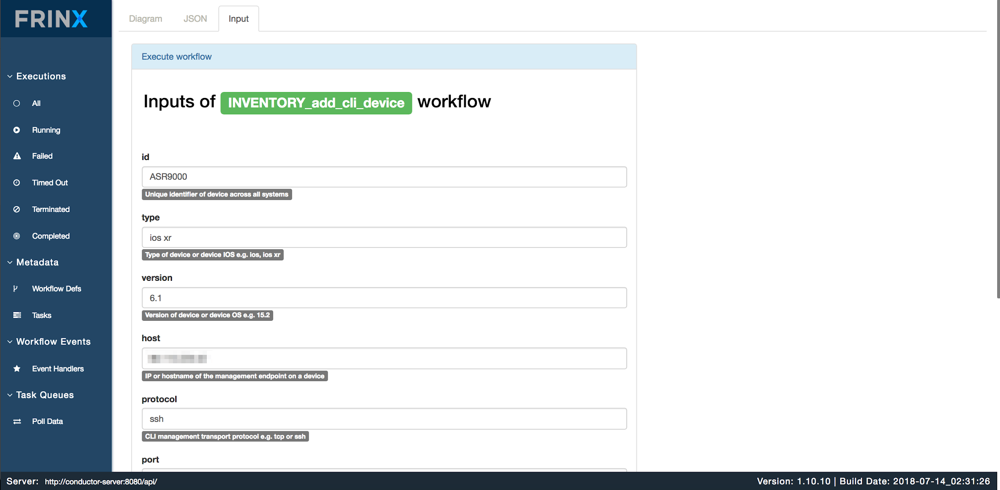
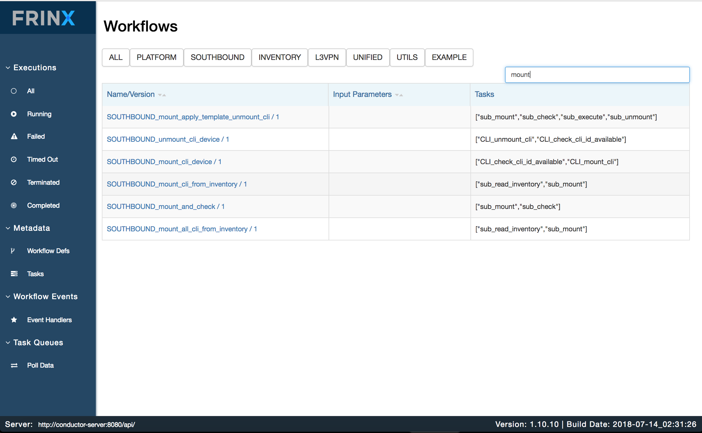
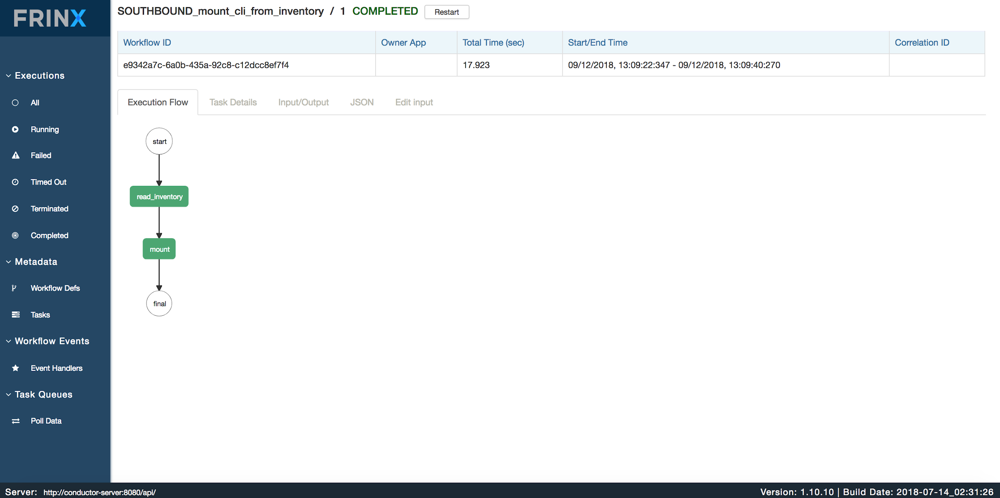
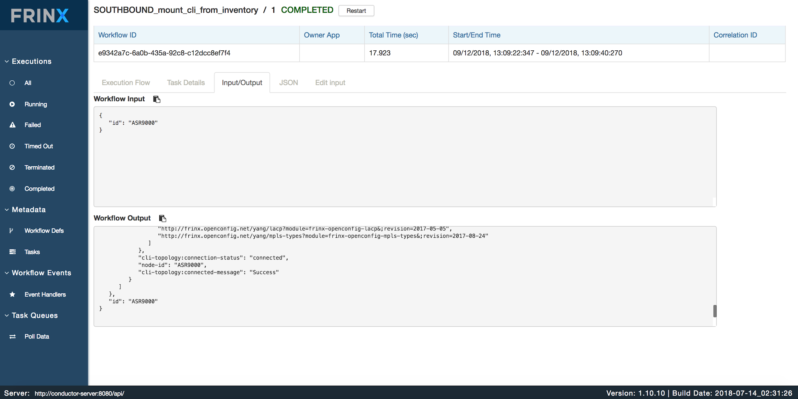
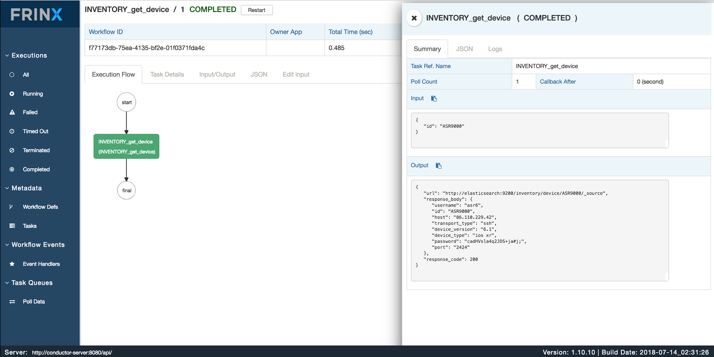
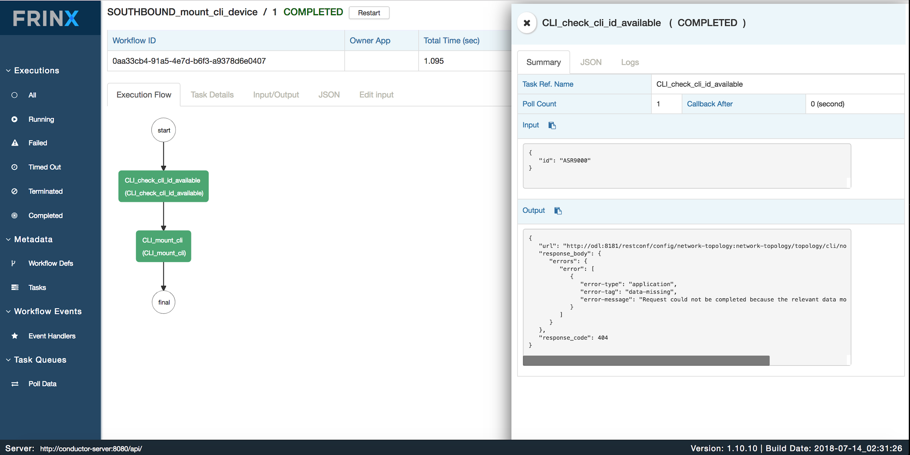
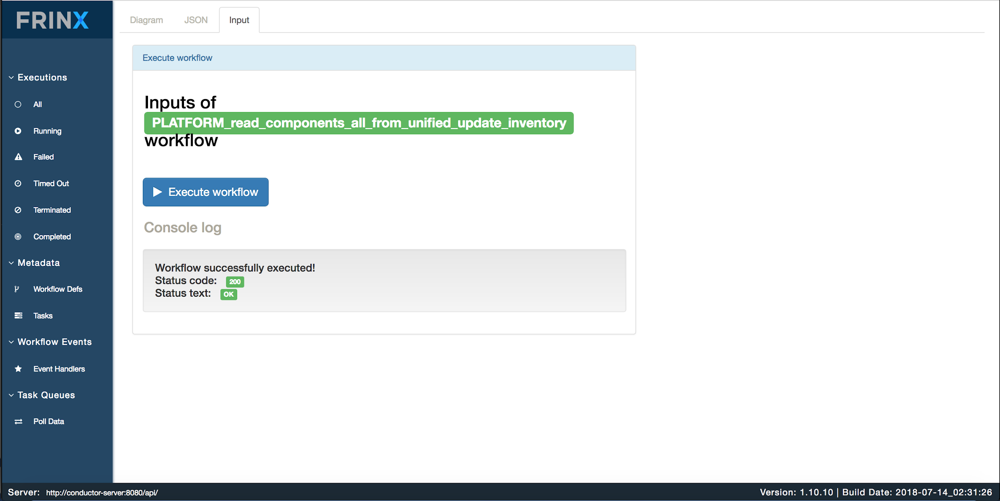

## Running workflows to obtain platform inventory data

In this section we show how users can execute workflows to obtain platform inventory data from devices in the network and to store them in the inventory (Elasticsearch).

The goal of this use case is to collect inventory information about physical devices via their vendor specific NETCONF or CLI interfaces, convert this information into OpenConfig data structures and store the resulting information as a child entry to its associated parent in Elasticsearch. The outcome is that users can manage their physical network inventory (line cards, route processors, modules, transceivers, etc …) across different hardware vendors in real-time via a single uniform interface.

### Create a new device in the inventory

In our first workflow we will create a device entry in our inventory via the FRINX workflow UI. Many customers will choose to import bulk data from other data sources like Excel or CSV files. Many data import tools exist for Elasticsearch (e.g. [https://github.com/knutandre/excelastic](https://github.com/knutandre/excelastic)). The import of bulk data is out of scope for this use case. We rather focus on data input via our GUI to demonstrate a simple set of workflows.

Click on "Metadata → Workflow Defs" and select the workflow called “INVENTORY_add_cli_device”. Select the tab “Input” and fill out the form. 

After you have filled out the form click on "Execute Workflow". You should see a similar response like the one shown below.

After successful execution of our first workflow, we can see the the new device created in Elasticsearch. 

### Mount the new device in FRINX OpenDaylight

Next we want to mount the device in ODL. The mount operation for NETCONF or CLI devices in ODL results in a permanent connection that is established, maintained and if necessary re-established with the device. Once a device is mounted in FRINX OpenDaylight, it can be accessed via the UniConfig framework for reading and writing configuration and operational data. The next workflow will mount the device in FRINX ODL. 

Click on "Metadata → Workflow Defs" and select the workflow to mount a single device: “SOUTHBOUND_mount_cli_from_inventory”

If you want to mount multiple devices from the inventory choose the workflow "SOUTHBOUND_mount_all_cli_from_inventory". 

Fill out the ID of the device for a single device or fill out the optional field "type" to specify which type of device you want to mount (e.g. “ios”, “io xr”, ...).  In our case the ID is “ASR9000” to mount a single device. After you clicked on “Execute workflow” you should see a similar view like the one below:

Now we will look how the workflows are executing and how we can check if they have succeeded. The workflow that we have executed will spawn a number of sub workflows and will only show completed if all sub workflows have completed successfully. You can verify the state of main and sub-workflows in this view. Click on "Executions → All" to see the status of each workflow.

In this view, we can see that all workflows have completed successfully. After the main workflow was executed it has spawned of multiple sub workflows until the last workflow checks if the device was successfully mounted. The following screenshots show additional information about the sub-workflows that is relevant to analysis and troubleshooting. 

Once the main workflow has successfully completed the device is mounted and can now be used to get information from the device or configure the device. 

### Collect platform information from the device and store in the inventory

In the next step we will execute a workflow that collects platform information from every mounted device, converts the vendor specific information into OpenConfig format and writes the resulting data to the inventory.

Click on “Metadata → Workflow Defs” and select the workflow: “PLATFORM_read_components_all_from_unified_update_inventory”

Once selected, you can execute the workflow without providing additional information.

Under “Executions → All” you can see the progress of the workflow, input/output data of each task and statistics associated with the workflow execution.

After the main and sub-workflows have completed successfully the platform information is now stored in the inventory as a child entry to the device ID that the information comes from.

The execution of all workflows can be manually, via the UI, or can be automated and scheduled via the REST API of conductor server.
