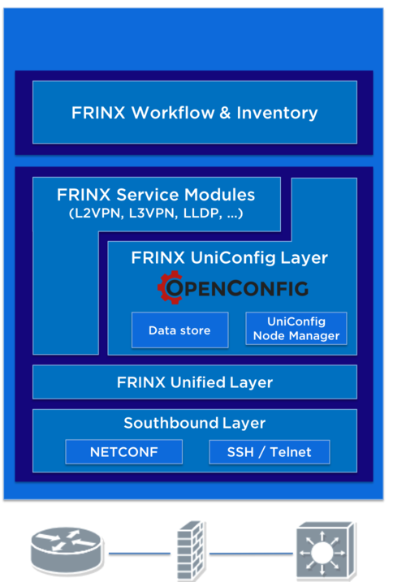
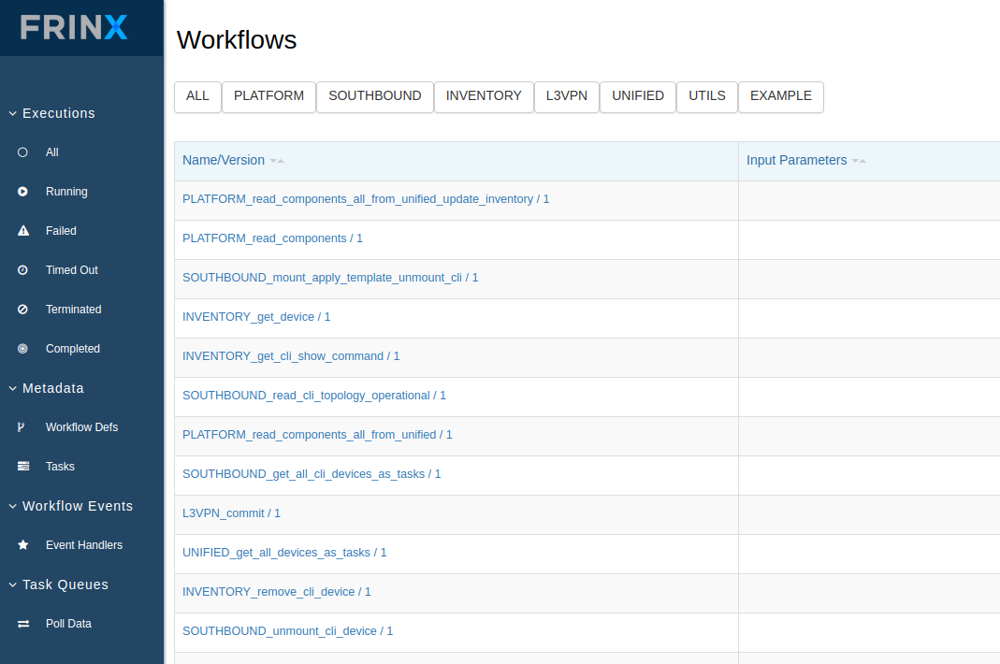
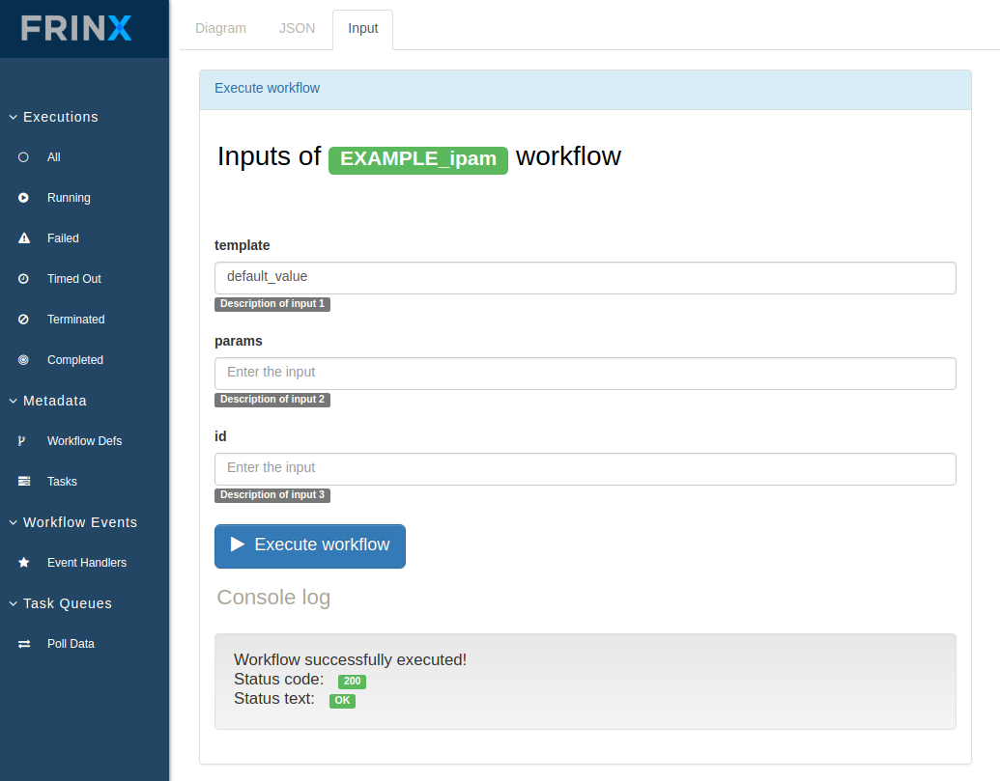

# FRINX Machine User Guide

FRINX Machine is a dockerized deployment of 3 element. 
Every one of them have specific responsibilities.

### FRINX Opendaylight (network automation solution)

 * Connects to the devices in network

 * Keeps connections between devices alive

 * Pushes configuration data to devices

 * Pulls configuration and operational data from devices

### Netflix Conductor (workflow engine)

 * Chains atomic tasks into complex workflows

 * Defines, executes and monitors workflows (via REST or UI)

### Elasticsearch (inventory and log data)

 * Storing inventory data
  
 * Storing log data

**The goal is to provide a platform enabling easy definition, execution and monitoring of complex workflows using FRINX Opendaylight.**

An example workflow could consist of:

1. Pulling device IP and mgmt credentials from an external IPAM system

2. Mounting a device

3. Verifying the device is connected

4. Executing a configuration template

5. Unmounting a device

We chose Netflix’s conductor workflow engine since it has been proven to be highly scalable open-source technology that integrates very well with FRINX Opendaylight. Further information about conductor can be found at:

* **Github**: [https://github.com/Netflix/conductor](https://github.com/Netflix/conductor)

* **Docs:** [https://netflix.github.io/conductor/](https://netflix.github.io/conductor/)

## High Level Architecture

Following diagram outlines main functional components in the FRINX Machine solution:

 

The following diagram outlines the container components of the FRINX Machine solution:

 

FRINX Machine repository is available at: [https://github.com/FRINXio/FRINX-machine](https://github.com/FRINXio/FRINX-machine)

Frinx-conductor repository is available at: [https://github.com/FRINXio/frinx-conductor](https://github.com/FRINXio/frinx-conductor)

Specialized ODL tasks are available at: [https://github.com/FRINXio/netinfra_utils](https://github.com/FRINXio/netinfra_utils) 

## Defining a workflow

Workflows are defined using a JSON based domain specific language (DSL) by wiring a set of tasks together. The tasks are either control tasks (fork, conditional etc) or application tasks (e.g. encode a file) that are executed on a remote machine.

FRINX Machine distribution comes in with number of pre-packaged workflows.

Detailed description of workflow and task definitions along with examples can be found at official [Netflix Conductor documentation](https://netflix.github.io/conductor/metadata/#workflow-definition).

## Starting a workflow

Initiate **Workflow UI** 

1. Open web browser
2. Type localhost:5000 

Navigate to: 

* Metadata
   * Workflow Defs

There is a list of all available workflow definitions.  
Choose one and switch to tab **Input**:

### Input

Workflows are supplied inputs by client when a new execution is triggered. 

Workflow input is a JSON payload that is available via `${workflow.input...}` expressions.

Each task in the workflow is given input based on the inputParameters template configured in workflow definition. 

`inputParameters` is a JSON fragment with value containing parameters for mapping values from input or output of a workflow or another task during the execution.

### Start workflow

Fill in JSON generated input fields. Input fields may contain default value or description provided in workflow definition. 

Press the button **Execute workflow** in order to start current workflow. 

**Console log** section at the bottom provides status information about workflow execution.

Executed workflows can be found at **Executions** tab on top of the collumn in menu on the left.

## Inspecting executed workflows 

Navigate to:

* Executions
   * All

Then, search and filter for specific workflows.

After clicking on specific workflow, you are able to see its details including outputs as well as other information about current workflow.

### Workflow actions 

Workflow actions are available after clicking on specific executed workflow. 

You are able to execute these actions to a specific workflow:

 * terminate
 * rerun
 * restart
 * retry
 * pause
 * resume

Running previously executed workflow as new workflow with same or edited inputs:

Navigate to **Edit Input** tab, where you are able to edit specific inputs and run workflow again.

