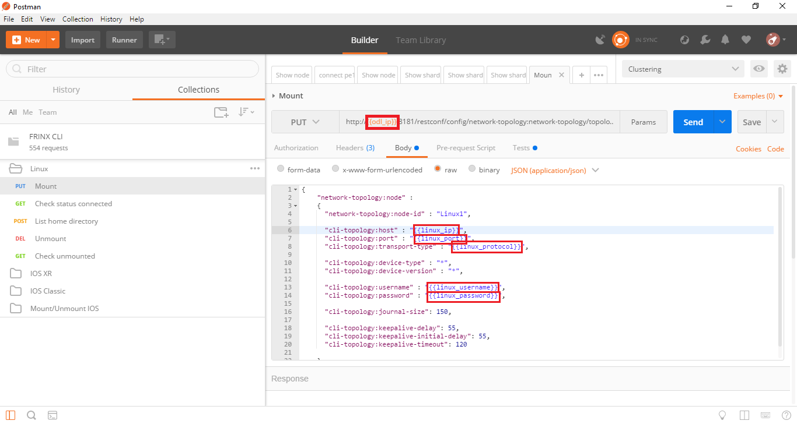

[Documentation main page](https://frinxio.github.io/Frinx-docs/)  
# API - Postman
<!-- TOC -->

- [API - Postman](#api---postman)
    - [Download Postman (free)](#download-postman-free)
    - [Download Frinx Postman collection and environment files](#download-frinx-postman-collection-and-environment-files)
    - [Importing Frinx Postman collection & environment files into Postman](#importing-frinx-postman-collection--environment-files-into-postman)
        - [Editing environments](#editing-environments)
    - [Versioning](#versioning)

<!-- /TOC -->
## Download Postman (free)
Frinx uses the free Postman REST client as an API for the Frinx ODL distribution. [Download Postman for your system](https://www.getpostman.com/postman)

## Download Frinx Postman collection and environment files
We have created collections of REST calls that form the API for the Frinx ODL distribution.
These REST calls are grouped together as **Postman collection** files. 

For some features we also provide **Postman environment** files (with suffix env.json). These make the REST calls easily configurable through the use of variables, whose values you can edit (see section below in importing).

Both the Frinx **Postman collection** and **Postman environment** files are grouped by Frinx ODL release (starting with 3.1.1) and packaged as zip files [here](https://github.com/FRINXio/Postman/releases). 

On that page, find your Frinx ODL version number and click on 'zip' to download to a location on your local machine. 

  

In a terminal on your local machine, unzip the file. This will create a new directory with the 
following subdirectories, grouped by FRINX ODL features: 

* `Infrastructure`          - [Bundle API](FRINX_Features_User_Guide/using-the-frinx-api-bundle.md), [Clustering](Operations_Manual/clustering-overview)
* `L2VPN Service Module`    - [L2VPN](FRINX_Features_User_Guide/l2vpn/l2vpn-service-module.md)
* `L3VPN Service Module`    - [L3VPN](FRINX_Features_User_Guide/l3vpn/l3vpn-service-module.md)
* `Uniconfig Framework`     - [CLI](FRINX_Features_User_Guide/cli/cli-service-module.md), [Uniconfig](FRINX_Features_User_Guide/uniconfig/architecture/architecture.md)  

## Importing Frinx Postman collection & environment files into Postman
Start Postman and click on **Import** near the top-left of the screen.

In the pop-up window which opens, click to select the file you want to import (both collection files and environment files are imported from here). 

  

Imported **Collection files** appear as folders on the left of the screen. They contain sets of REST calls which allow you to interact with FRINX ODL and to use FRINX ODL to interact with network devices.

  

### Editing environments

Imported **Environment files** contain variables whose values you can update by clicking on the cog icon near the top-right of Postman and selecting **Manage Environments**.  

  

All the environments you have imported or created will be listed:  

  

CLick on the environment you wish to edit. You are then able to set values for each key (variable):

  

The values you set for a key is substituted for the key wherever it appears within your calls. Within calls, keys are always shown within double sets of curly braces:

   

## Versioning
Between releases we also publish release candidate (RC) zip files [in the same location](https://github.com/FRINXio/Postman/releases) which are pre-release versions in the development stage. These correspond with pre-release versions of Frinx ODL.  

Backwards compatibility of Frinx Postman collections:   
`Infrastructure`        - Works with all releases of Carbon, Boron, Beryllium Frinx ODL  
`L2VPN Service Module`  - Works with all releases of Carbon, Boron Frinx ODL  
`L2VPN Service Module`  - Works with all releases of Carbon, Boron Frinx ODL  
`Uniconfig Framework`   - Works only with corresponding version of Frinx ODL  
