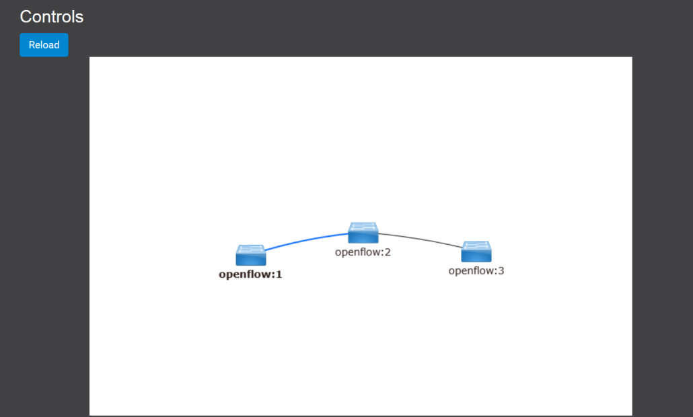

[Documentation main page](https://frinxio.github.io/Frinx-docs/)
[Operations Manual main page](https://frinxio.github.io/Frinx-docs/FRINX_ODL_Distribution/Boron/operations_manual.html)
# Connecting to an OpenFlow Switch

<!-- TOC START min:1 max:3 link:true update:true -->
- [Connecting to an OpenFlow Switch](#connecting-to-an-openflow-switch)
  - [Installing Openflow features using the karaf console](#installing-openflow-features-using-the-karaf-console)

<!-- TOC END -->

In OpenDaylight, OpenFlow is implemented by the following features: odl-l2switch (and dependencies), openflowplugin and openflowjava. These can be installed in one of the following two ways:

## Installing Openflow features using the karaf console  
Open or connect to a karaf console and type:

    feature:install odl-l2switch-all  
    feature:install odl-restconf  
    feature:install odl-mdsal-apidocs  
    feature:install odl-dlux-all  

(odl-dlux-all is installed by default)

## Set up Mininet  
The easiest way to do this is to download a mininet virtual machine (VM) from <https://github.com/mininet/mininet/wiki/Mininet-VM-Images> Then configure your environment so that you can connect to the Mininet VM from the machine hosting the Frinx controller. For example: if the Frinx ODL Distribution is hosted at 10.10.199.149 and Mininet is installed at 10.10.199.20, a ping should work in both directions.  
Use the following command to start Mininet, replacing < your controller ip > with the IP address of the machine hosting the Frinx controller.

    sudo mn --topo linear,3 --mac --controller=remote,ip=< your controller ip >,port=6633 --switch ovsk,protocols=OpenFlow13  

If the command is successful, then if you go to

<http://10.10.199.149:8181/index.html#/topology> you will see something like the screenshot below: 
The OpenDaylight userguide describes alternative ways to start mininet: [https://nexus.opendaylight.org/content/sites/site/org.opendaylight.docs/master/userguide/manuals/userguide/bk-user-guide/content/\_create\_a_network_using_mininet.html][2]

 [1]: http://localhost:8181/index.html#/featuremgr/index
 [2]: https://nexus.opendaylight.org/content/sites/site/org.opendaylight.docs/master/userguide/manuals/userguide/bk-user-guide/content/_create_a_network_using_mininet.html
