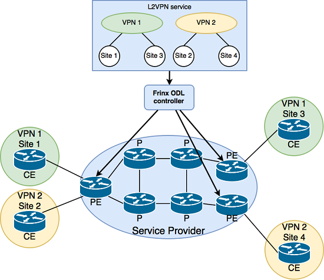
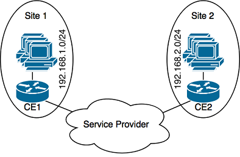
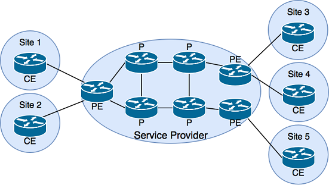
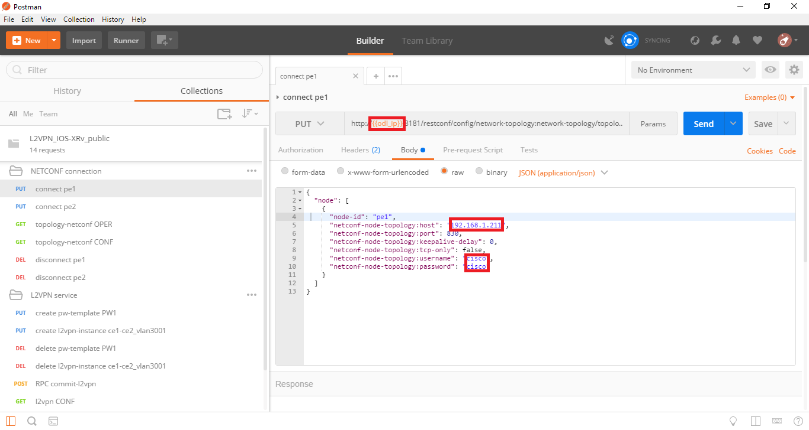
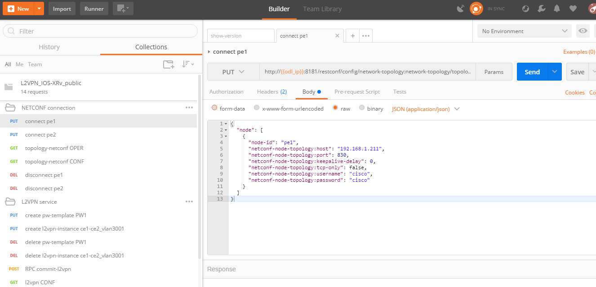
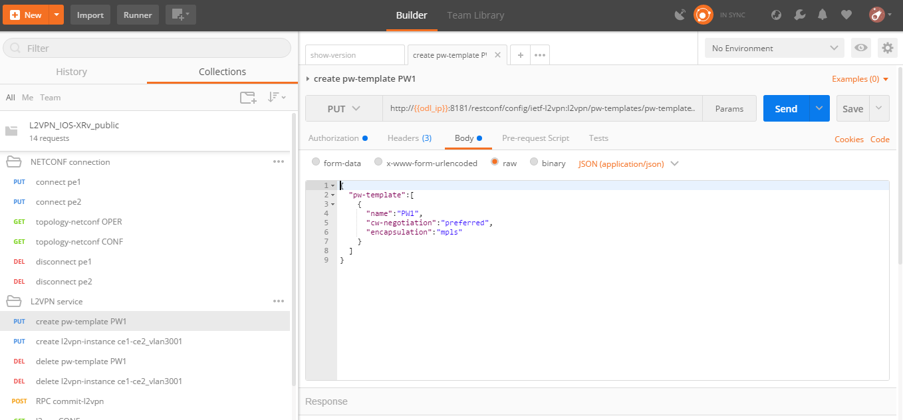
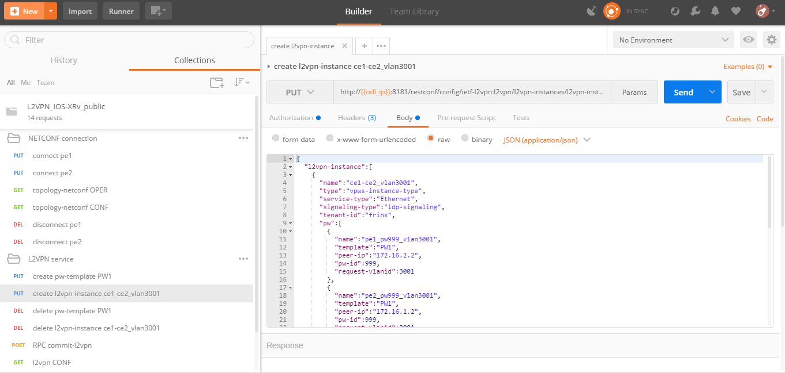

[Documentation main page](https://frinxio.github.io/Frinx-docs/)
[FRINX Features User Guide main page](https://frinxio.github.io/Frinx-docs/FRINX_ODL_Distribution/Carbon/user_guide.html)
# L2VPN Service Module User Guide
<!-- TOC -->

- [L2VPN Service Module User Guide](#l2vpn-service-module-user-guide)
    - [Usage - setup](#usage---setup)
        - [Postman - Import collection](#postman---import-collection)
        - [Frinx ODL - Install features](#frinx-odl---install-features)
    - [Introduction](#introduction)
    - [A bit about L2VPN](#a-bit-about-l2vpn)
        - [Problem definition and L2VPN](#problem-definition-and-l2vpn)
        - [Terminology](#terminology)
        - [L2VPN types](#l2vpn-types)
            - [VPWS](#vpws)
    - [Usage - Operations Guide](#usage---operations-guide)
        - [Set up an L2VPN connection](#set-up-an-l2vpn-connection)
        - [Delete the L2VPN connection](#delete-the-l2vpn-connection)
        - [Frinx l2vpn demo video (setup and deletion)](#frinx-l2vpn-demo-video-setup-and-deletion)
            - [frinx-l2vpn-testing](#frinx-l2vpn-testing)
    - [L2VPN Provider](#l2vpn-provider)
        - [Use Case Specification](#use-case-specification)
        - [Architecture](#architecture)
            - [API description](#api-description)
                - [ietf-l2vpn@2017-08-02.yang](#ietf-l2vpn2017-08-02yang)
        - [Network Element Plugin](#network-element-plugin)
            - [IOS-XRv Network Element Plugin](#ios-xrv-network-element-plugin)
            - [Mock Network Element Plugin](#mock-network-element-plugin)
        - [Limitations](#limitations)

<!-- /TOC -->

## Usage - setup
### Postman - Import collection
1. To download and use FRINX pre-configured Postman REST calls with L2VPN - see [this page](../../API.md).  

2. Follow that guide to import the file `postman_collection_L2VPN_IOS-XRv.json` from the directory `L2VPN Service Module`.

### Frinx ODL - Install features
1. First, [start Frinx ODL](../../Operations_Manual/running-frinx-odl-after-activation.md)

Wait for 3 minutes to ensure the start up process is complete.  

2. Then, in the karaf terminal which will have started, install two features - RESTCONF and the l2vpn provider:  

```
feature:install odl-restconf frinx-l2vpn-iosxrv 
```

**odl-restconf** enables us to communicate between Frinx ODL and the routers by using REST calls (which we issue with Postman).  

**frinx-l2vpn-iosxrv** is an L2VPN Provider with the IOS-XRv (Network Element Plugin) NEP and a NETCONF connector. This particular feature is specific for IOS-XRv devices.  

You now have your system ready to provision l2vpn. The **Operations Guide** follows the **Introduction section** below.  

## Introduction
The goal of this project is to automate provisioning of Layer 2 Virtual Private Networks (L2VPN) on Service Provider (SP) routers. This is done by using the Frinx ODL controller which configures routers based on intent of the L2VPN service. The Frinx ODL controller translates the L2VPN service abstraction to network element configuration. 

## A bit about L2VPN
### Problem definition and L2VPN
Let's take the scenario where a company needs to reconnect multiple sites with each other via an SP which provides L2 services to the company. The company's sites needs to see each other as directly connected on L3. L2VPN offers a solution for those requirements.

The company has two different sites and they are both connected to the Service Provider using an L2 connection. They need to interconnect two of their sites. 

In this case L2VPN provides site-to-site connectivity and the SP network behaves as a wire between the company’s sites. The company’s routes are exchanged via the SP network. 

### Terminology
These terms are usually used in the L2VPN domain:

*   **Customer Edge (CE)** device – router at customer site connected to SP
*   **Provider Edge (PE)** device – router at the edge of the SP network which provides connectivity for CE
*   **Provider (P)** device – core router on the SP network providing connectivity among PE routers



### L2VPN types
There are two main types of L2VPN:

*   point-to-point
*   point-to-multipoint

These types have many implementations. The Frinx ODL distribution supports Virtual Private Wire Service (VPWS) implementation.

#### VPWS
VPWS (Virtual Private Wire Service) is the simplest form for enabling Ethernet services over MPLS. It is also known as ETHoMPLS (Ethernet over MPLS), or VLL (Virtual Leased Line). VPWS is point-to-point L2VPN which usually uses MPLS in core networks for signaling and creates pseudo-wires on PE routers for separation of L2 connections. L2 connections are identified by interface or VLAN. The picture below shows an MPLS core network with pseudo-wires on PEs for each VPN which are identified by VLAN.


## Usage - Operations Guide
To import the necessary Postman collection file see the section **Postman - Import collection** at the top of this page.  

That file contains several REST calls for establishing a NETCONF connection and creating or deleting L2VPN instances (the values within the red boxes in the image below will need to be edited for your setup. The value for odl_ip should be set in a Postman environment [guidance here](../../API.md) - that way it needs only be entered once and will be applied to each call. The other values can be edited directly within the call bodies.



### Set up an L2VPN connection
Three steps are required to create an l2vpn connection between two routers (we perform these in our [video](https://youtu.be/UkHj9OgHHyo) which you can use a reference):  

1. Establish a NETCONF connection between Frinx ODL and each of the two routers between which the L2VPN will be configured:
To do this, use Postman REST calls: `NETCONF connection/connect pe1` (for router 1) and `NETCONF connection/connect pe2` (for router 2)  

- Configure the REST call `NETCONF connection/connect pe1` according to your setup for router 1:  
*URL:*  In the URL, replace `{{odl_ip}}` with the IP of the system you are running the Frinx ODL distribution on. Or [create an environment in Postman](../../API.md) where you set a value for `odl_ip`.  
*Body:* In the call body, edit the fields according to your setup:    
```json
{
  "node": [
    {
      "node-id": "pe1",
      "netconf-node-topology:host": "192.168.1.211",  Edit this according to your setup
      "netconf-node-topology:port": 830,
      "netconf-node-topology:keepalive-delay": 0,
      "netconf-node-topology:tcp-only": false,
      "netconf-node-topology:username": "cisco",  Edit this according to your setup
      "netconf-node-topology:password": "cisco"   Edit this according to your setup
    }
  ]
}
```


- Issue the call by hitting **Send**. You should receive the Response: Status **201 Created**

- Now configure the REST call `NETCONF connection/connect pe2` in the same way, but this time editing the REST call body according to your setup for router 2  

- Again, issue the call, ensuring you receive the Response: Status **201 Created**

- Before we can proceed any further, we need to confirm that FRINX ODL has successfully established NETCONF connections with routers 1 and 2. This normally takes a few minutes. We can check if the connections have been established by issuing the Postman REST call `NETCONF connection/topology-netconf OPER` and checking that:
  - You receive the Response: Status **200 OK**
  and
  - When you scroll through the Response body (this is very large) you see a list **"available-capability"** for both **"node-id": "pe1"** and **"node-id": "pe2"**. If these are not listed, wait another minute and issue the call again.

2. Create a pseudo-wire (PW) template (which will be used in the next step when we create the L2VPN instance).  
Postman REST call: `L2VPN Service/create PW template PW1`  
You don't need to change any of the fields of the call body. You can change **name** if you wish.  
```json
{  
  "pw-template":[  
    {  
      "name":"PW1",
      "cw-negotiation":"preferred",
      "encapsulation":"mpls"
    }
  ]
} 
```


3. Create the L2VPN instance.  
Postman REST call: `L2VPN Service/create l2vpn instance ce1-ce2_vlan3001`  
- Configure the call:  
*URL:*  In the URL, replace `{{odl_ip}}` with the IP of the system you are running the Frinx ODL distribution on. Or [create an environment in Postman](../../API.md) where you set a value for `odl_ip`.  
*Body:* In the call body, edit the following fields according to your setup:  
```json
{  
  "l2vpn-instance":[  
    {  
      "name":"ce1-ce2_vlan3001",  
      "type":"vpws-instance-type",
      "service-type":"Ethernet",
      "signaling-type":"ldp-signaling",
      "tenant-id":"frinx",
      "pw":[
        {
          "name":"pe1_pw999_vlan3001",  
          "template":"PW1", If you edited the name in step 2. above, then use the same name here
          "peer-ip":"172.16.2.2",   Edit to the IP of the interface on router 2
          "pw-id":999,
          "request-vlanid":3001
        },
        {
          "name":"pe2_pw999_vlan3001",  Edit this according to your setup
          "template":"PW1", If you edited the name in step 2. above, then use the same name here
          "peer-ip":"172.16.1.2",  Edit to the IP of the interface on router 1
          "pw-id":999,
          "request-vlanid":3001
        }
      ],
      "endpoint":[
        {
          "name":"ce1",
          "pe-node-id":"pe1",
          "pe-2-ce-tp-id":"GigabitEthernet0/0/0/0",
          "pw":[
            {
              "name":"pe1_pw999_vlan3001"   
            }
          ]
        },
        {
          "name":"ce2",
          "pe-node-id":"pe2",
          "pe-2-ce-tp-id":"GigabitEthernet0/0/0/0",
          "pw":[
            {
              "name":"pe2_pw999_vlan3001"
            }
          ]
        }
      ]
    }
```

- Issue the call by hitting **Send**. You should receive the Response: Status **201 Created**


- We now need to commit by RPC: Issue the Postman REST call `L2VPN Service/RPC commit-l2vpn`. In the Response body You should receive "status": "complete". This shows the setup has been competed successfully.


### Delete the L2VPN connection
1. Delete the pseudo-wire template by using the Postman REST call: `L2VPN Service/delete PW template PW1`. There is no body to the call. 
If you have not already set an environment, then just edit the URL of the call to replace `{{odl_ip}}` with the IP of the system you are running the Frinx ODL distribution on.  
2. Delete the l2vpn instance by using the Postman REST call: `L2VPN Service/delete PW template PW1`. There is no body to the call. 
If you have not already set an environment, then just edit the URL of the call to replace `{{odl_ip}}` with the IP of the system you are running the Frinx ODL distribution on.
3. We now need to commit by RPC: Issue the Postman REST call `L2VPN Service/RPC commit-l2vpn`. In the Response body You should receive "status": "complete". This shows the deletion has been competed successfully.


### Frinx l2vpn demo video (setup and deletion)
See our [video](https://youtu.be/UkHj9OgHHyo)  

#### frinx-l2vpn-testing
We also provide a feature which can be used for testing the l2vpn feature:  
**Karaf installation:**

    feature:install frinx-l2vpn-testing

## L2VPN Provider
L2VPN Provider is an implementation which automatically provisions L2VPN on PE routers based on intended L2VPN service. It exposes a domain specific API for L2VPN manipulation and declarative configuration “what vs how”. L2VPN Provider supports network wide transactions which are transactions on top of multiple devices. Rollback of a network wide transaction means rollback of configuration on each device which was a part of the conifiguration. The rollback of a network wide transaction is done automatically if there is failed configuration on at least one device.

### Use Case Specification
L2VPN Provider can be used on a network where:

*   VPWS L2VPN is needed
*   VLAN is used for pseudo-wire selection
*   MPLS encapsulation is used in SP core


L2VPN Provider works only with devices which have these capabilities:
<table>
  <thead>
    <tr>
      <th>
        Name
      </th>
      <th>
        Revision
      </th>
    </tr>
  </thead>
  <tbody>
    <tr>
      <td>
        Cisco-IOS-XR-l2-eth-infra-cfg
      </td>
      <td>
        2015-11-09
      </td>
    </tr>
    <tr>
      <td>
        Cisco-IOS-XR-ifmgr-cfg
      </td>
      <td>
        2015-07-30
      </td>
    </tr>
    <tr>
      <td>
        Cisco-IOS-XR-l2vpn-cfg
      </td>
      <td>
        2015-11-09
      </td>
    </tr>
    <tr>
      <td>
        rollback-on-error
      </td>
      <td>
      </td>
    </tr>
  </tbody>
</table>

The capabilities are sent from XR to ODL automatically during device connection via NETCONF.
You can see the NETCONF capabilities under each node by calling:
GET http://{{odl_ip}}:8181/restconf/operational/network-topology:network-topology/topology/topology-netconf

A list of PE nodes can be obtained from:
GET http://{{odl_ip}}:8181/restconf/operational/network-topology:network-topology/topology/l2vpn-provider-edge-topology

### Architecture
L2VPN Provider is composed of multiple components. The high level architecture is shown in the picture below.


An external application modifies *ietf-l2vpn* in CONF DS. L2VPN can be configured on nodes which are read from *l2vpn-provider-edge-topology*. When all changes are done, the external application calls RPC *commit-l2vpn*. The RPC reads *ietf-l2vpn* from CONF DS (the intended state) and from OPER DS (the actual state). Diff is created based on intended and actual state. This diff is configured inside network wide transaction on the necessary PE routers by using particular Network Element Plugins. If configuration of routers is successful then a new *ietf-l2vpn* is stored to OPER DS and RPC output is returned with status "complete". In case configuration on one of the devices fails, the rollback of the network wide transaction starts and if the rollback is successful then RPC output has status "commit-failed-rollback-complete", otherwise the status is "inconsistent". The architecture can be extended very easily because Network Element Plugin needs to implement only NEP SPI, rollback, and network element registration. IOS NEP from the picture is not yet implemented.

As was mentioned, NEP registers network elements to L2VPN Provider. L2VPN Provider stores network elements as nodes to abstract topology *l2vpn-provider-edge-topology* and this topology is a source of nodes which can be used for L2VPN configuration.

#### API description
The API is described using YANG modules. An external application can consume the API via RESTCONF, NETCONF, or JAVA. The L2VPN service module provides domain specific abstraction where the abstraction describes attributes of VPNs and sites instead of configuration of network elements. The FRINX ODL Distribution translates the abstraction to network element configuration.

##### ietf-l2vpn@2017-08-02.yang
[ietf-l2vpn@2017-08-02.yang](ietf-l2vpn@2017-08-02.yang)

Original YANG is from [RFC draft - YANG Data Model for MPLS-based L2VPN](https://tools.ietf.org/html/draft-ietf-bess-l2vpn-yang-05). This YANG module is modified due to compatibility with OpenDaylight and is extended with L2VPN Provider elements - see the modified YANG module [ietf-l2vpn@2017-08-02.yang](ietf-l2vpn@2017-08-02.yang)

The YANG module contains 2 root statements and one RPC:

*   **container l2vpn** – represents intended state stored in CONF DS and actual state stored in OPER DS
*   **container l2vpn-state** – not used in current implementation
*   **rpc commit-l2vpn** – configures intent of L2VPN service. The output of RPC is the result of service configuration.

### Network Element Plugin
Network Element Plugin (NEP) is a unit which implements SPI from the L2VPN Provider. This NEP is device API specific and is responsible for:

*   announcement of discovered device (PE) to the L2VPN Provider
*   translation between SPI Data Transfer Objects (DTO) and device configuration
*   rollback of configuration on a device

#### IOS-XRv Network Element Plugin
This plugin configures L2VPN on IOS-XRv using NETCONF. It listens on topology-netconf and announces PE capable devices to the L2VPN Provider. Rollback on a device is done automatically using the "Rollback-on-Error" capability.


IOS-XRv NEP listens on nodes in *topology-netconf*. When a new IOS-XRv device is connected to Frinx ODL it appears as a new node in *topology-netconf* and IOS-XRv registers that node as PE to L2VPN Provider. If L2VPN Provider calls SPI in order to configure PEs via the IOS-XRv NEP, NETCONF is used for device configuration.

Here is an example of L2VPN configuration on IOS-XRv (parameters encapsulated in ** are specific for VPN or site):

<pre>interface **GigabitEthernet0/0/0/0** l2transport
 no shutdown
!

interface **GigabitEthernet0/0/0/0.3001** l2transport
 encapsulation dot1q **3001**
 rewrite ingress tag pop 1 symmetric
 no shutdown
!

l2vpn
 pw-class **PW1**
  encapsulation mpls
   control-word
  !
 !
 xconnect group **frinx**
  p2p **ce1**
   interface **GigabitEthernet0/0/0/0.3001**
   neighbor ipv4 **172.16.2.2** pw-id **999**
    pw-class **PW1**
   !
  !
 !
!
</pre>

#### Mock Network Element Plugin
The purpose of this plugin is to mock functionality of the Network Element Plugin. It is mainly use for testing when you do not need to connect real devices. 

The Mock NEP listens on nodes from *mock-pe-topology*. When a node is created, the NEP registers this node as a PE node to the L2VPN Provider. When the L2VPN Provider calls the SPI which Mocks NEP implements, intead of configuration of real devices, the SPI DTOs are logged.

### Limitations
Implementation of L2VPN provider does not support all statements in ietf-l2vpn@2017-08-02.yang. All supported elements are listen in the postman collection. L2VPN Provider does not support reconciliation, therefore only L2VPNs created via L2VPN Provider are visible through the API.

Other limitations:

*   only MPLS encapsulation is supported
*   only VLAN can be used between CE and PE for pseudo-wire selection
*   pre-configured MPLS among PEs must exist

**Description:**  
Installs L2VPN Provider with Mock NEP and RESTCONF. This feature can be used for testing and demonstration purposes where real PE devices are not available.

*The postman collection for the L2VPN service module can be downloaded from [here](https://github.com/FRINXio/Postman/releases).*

| Feature Guide         |             |                                                                                                     |
|-----------------------|-------------|-----------------------------------------------------------------------------------------------------|
|  | FRINX 3.1.0 | Removed all elements from yang which are not supported in implementation |
| Feature introduced in | FRINX 2.3.1 | VPN service module implementation with support for L2VPN and IOS XR (Version 6.1.2) NEP via NETCONF |

