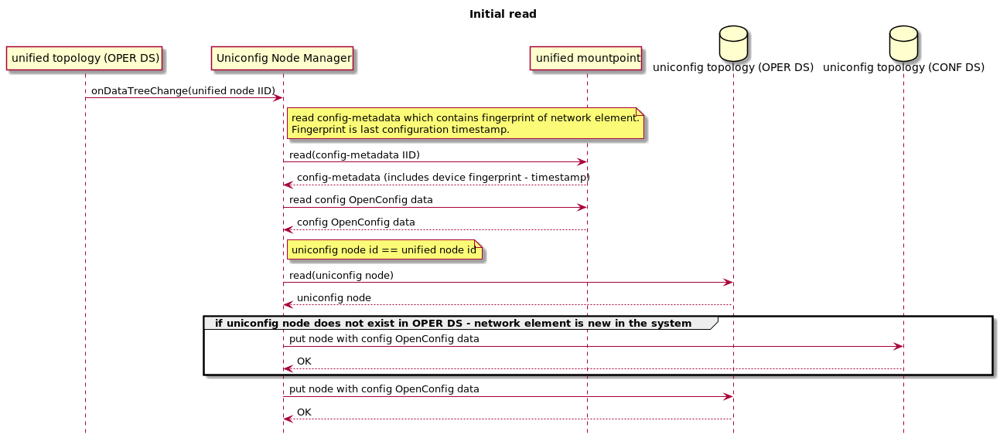
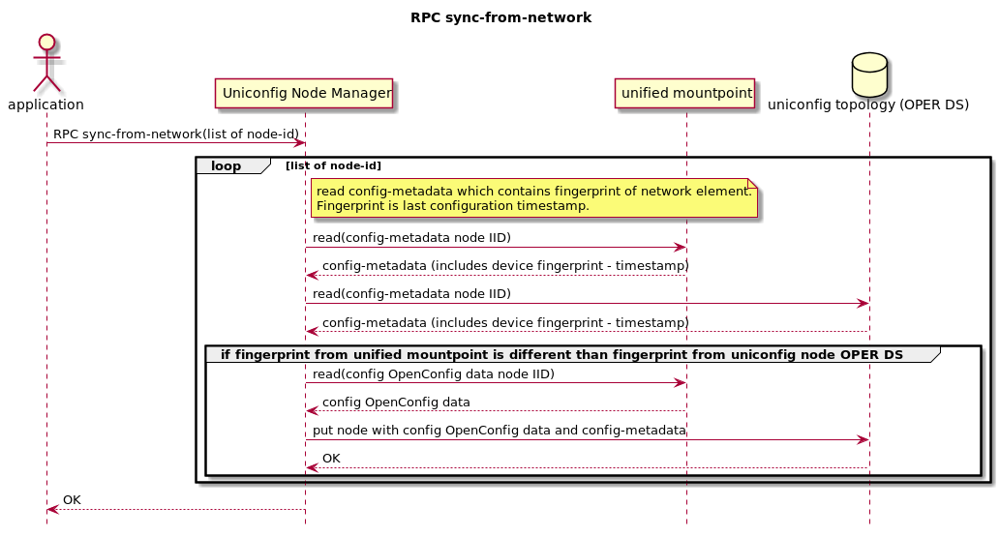
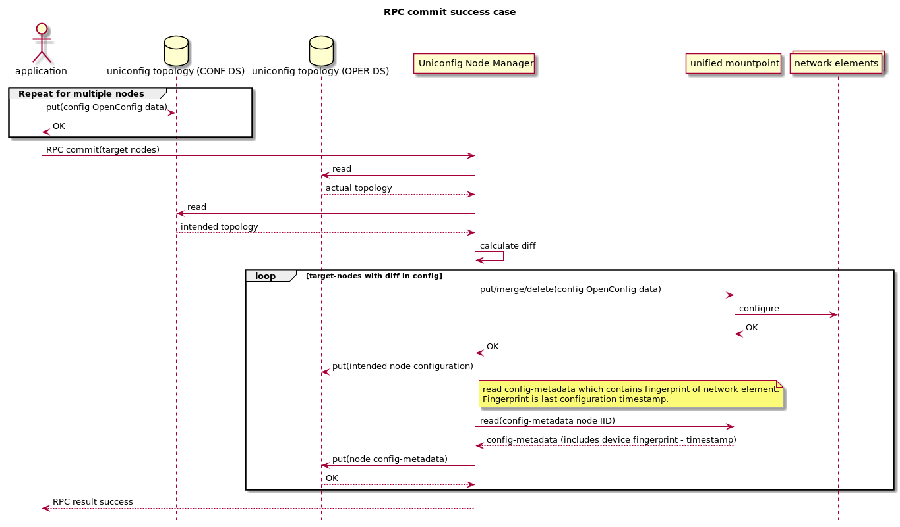
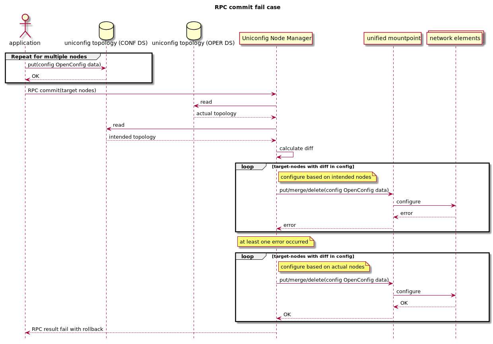
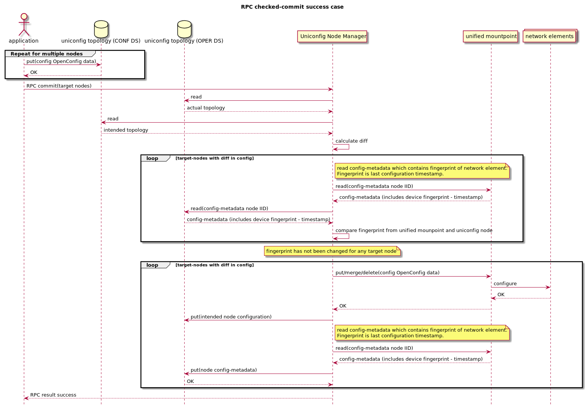
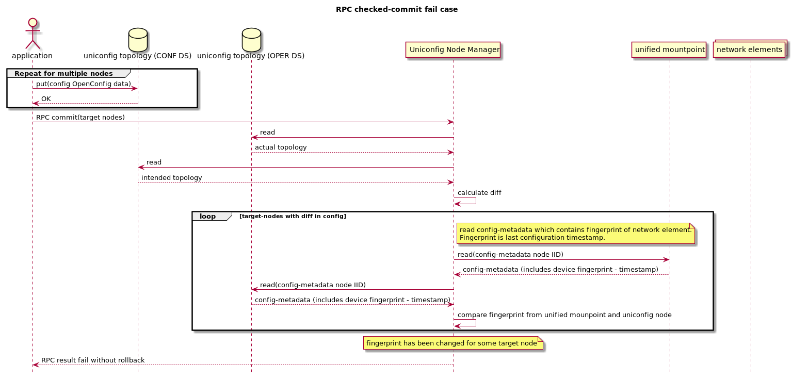
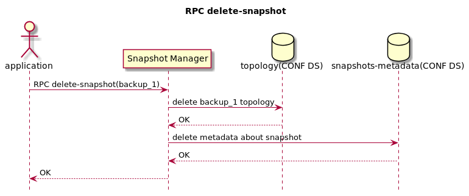
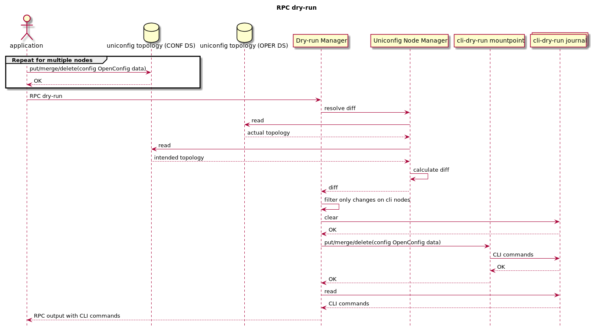

[Documentation main page](https://frinxio.github.io/Frinx-docs/)  
[FRINX Features User Guide main page](https://frinxio.github.io/Frinx-docs/FRINX_ODL_Distribution/Carbon/user_guide.html)  
<!-- TOC -->

- [UniConfig framework](#uniconfig-framework)
    - [Mounting CLI or NETCONF network element](#mounting-cli-or-netconf-network-element)
        - [CLI](#cli)
        - [NETCONF](#netconf)
    - [UniConfig API description](#uniconfig-api-description)
        - [Config initialization](#config-initialization)
        - [RPC sync-from-network](#rpc-sync-from-network)
            - [Example](#example)
        - [RPC commit](#rpc-commit)
            - [Example](#example-1)
        - [RPC checked-commit](#rpc-checked-commit)
            - [Example](#example-2)
        - [RPC calculate-diff](#rpc-calculate-diff)
            - [Example](#example-3)
        - [RPC replace-config-with-operational](#rpc-replace-config-with-operational)
            - [Example](#example-4)
- [Snapshot Manager](#snapshot-manager)
    - [Snapshot Manager API description](#snapshot-manager-api-description)
        - [Obtaining snapshots-metadata](#obtaining-snapshots-metadata)
        - [RPC maximum-snapshot-limit](#rpc-maximum-snapshot-limit)
            - [Example](#example-5)
        - [RPC create-snapshot](#rpc-create-snapshot)
            - [Example](#example-6)
        - [RPC delete-snapshot](#rpc-delete-snapshot)
            - [Example](#example-7)
        - [RPC replace-config-with-snapshot](#rpc-replace-config-with-snapshot)
            - [Example](#example-8)
- [Dry-run Manager](#dry-run-manager)
    - [Dry-run Manager API description](#dry-run-manager-api-description)
        - [RPC dry-run](#rpc-dry-run)
            - [Example](#example-9)

<!-- /TOC -->
This document describes API and use cases how UniConfig framework can be used by
an external or OpenDaylight application.  
[RESTCONF](https://frinxio.github.io/Frinx-docs/FRINX_ODL_Distribution/Carbon/FRINX_Features_User_Guide/restconf.html)
is used for API description and REST call examples in this document.

UniConfig reference REST calls can be downloaded as [uniconfig demo postman collection](https://github.com/FRINXio/Postman/blob/carbon/development/Uniconfig%20Framework/uniconfig_demo_postman_collection.json).

[More about OpenDaylight controller and its concepts](http://docs.opendaylight.org/en/stable-carbon/developer-guide/controller.html?highlight=restconf)

# UniConfig framework
[Overview and architecture](../architecture/architecture.md)

## Mounting CLI or NETCONF network element
Mounting CLI or NETCONF network element.


### CLI
More information about CLI mounting can be found [here](https://frinxio.github.io/Frinx-docs/FRINX_ODL_Distribution/Carbon/FRINX_Features_User_Guide/cli/cli-service-module.html#mounting-a-cli-device)

[cli-topology.yang](yang/cli-topology.yang)

[Tree representation of cli-topology.yang](yang/cli-topology.html)

[Examples in Postman collection](https://github.com/FRINXio/Postman/blob/carbon/development/Uniconfig%20Framework/uniconfig_demo_postman_collection.json)

### NETCONF
More information about NETCONF mounting can be found [here](http://docs.opendaylight.org/en/stable-carbon/user-guide/netconf-user-guide.html#southbound-netconf-connector)

[netconf-node-topology.yang](yang/netconf-node-topology.yang)

[Tree representation of netconf-node-topology.yang](yang/netconf-node-topology.html)

[Examples in Postman collection](https://github.com/FRINXio/Postman/blob/carbon/development/Uniconfig%20Framework/uniconfig_demo_postman_collection.json)

## UniConfig API description
[uniconfig-manager.yang](yang/uniconfig-manager.yang)

*NOTE: mouse hover on elements in tree representation shows description*

[Tree representation of uniconfig-manager.yang](yang/uniconfig-manager.html)

### Config initialization
Initial reading of network element configuration is triggered when unified
node is created in operational datastore. Reading of data from network element is delegated
to unified mountpoint. Only config data are read from unified mountpoint.
Data is stored as uniconfig node to config and operational datastore.
If uniconfig node already exist in operational datastore, data is stored only
to operational datastore (e.g. in case of reconnect).



### RPC sync-from-network
Purpose of this RPC is to synchronize configuration from network
elements to uniconfig nodes in operational datastore.  
RPC input contains list of uniconfig nodes where to refresh configuration
from network. Empty input means all nodes.



#### Example
RPC input contains list of uniconfig nodes where configuration should be
refreshed.

RPC request:
```
curl -X POST \
  http://192.168.56.11:8181/restconf/operations/uniconfig-manager:sync-from-network \
  -H 'content-type: application/json' \
  -d '{
    "input": {
        "target-nodes": {
            "node": ["IOSXR"]
        }
    }
}'
```

RPC response - success:

```
{
    "output": {
        "node-sync-status-results": {
            "overall-sync-status": "complete",
            "node-sync-status-result": [
                {
                    "nodeId": "IOSXR"
                }
            ]
        }
    }
}
```

### RPC commit
External or ODL application stores intended configuration under nodes
in uniconfig topology. Trigger for execution of configuration is RPC
commit.  
RPC input contains list of uniconfig nodes where to commit configuration.
Empty input means all nodes. Output of RPC describes result of commit.

[List of supported configuration data](https://github.com/FRINXio/translation-units-docs/tree/master/Configuration%20datasets)

Successful RPC commit is on figure below.



Failed RPC commit with automatic rollback is on figure below.



#### Example
RPC commit input has one target node and output describes result of commit.

RPC request:
```
curl -X POST \
  http://192.168.56.11:8181/restconf/operations/uniconfig-manager:commit \
  -H 'content-type: application/json' \
  -d '{
    "input": {
        "target-nodes": {
            "node": ["IOSXR"]
        }
    }
}'
```

RPC response - success:

```
{
    "output": {
        "overall-configuration-status": "complete",
        "node-config-results": {
            "node-config-result": [
                {
                    "nodeId": "IOSXR",
                    "configuration-status": "complete"
                }
            ]
        }
    }
}
```

### RPC checked-commit
External or ODL application stores intended configuration under nodes
in uniconfig topology. Trigger for execution of checked configuration is
RPC checked-commit. Checked commit is similar to RPC commit but it also
checks if nodes are in sync with network before configuration.
RPC fails if some node is out of sync.  
RPC input contains list of uniconfig nodes where to commit configuration.
Empty input means all nodes. Output of RPC describes result of commit.

[List of supported configuration data](https://github.com/FRINXio/translation-units-docs/tree/master/Configuration%20datasets)

Successful RPC checked-commit is on figure below.



Failed RPC checked-commit before configuration is on figure below.



#### Example
RPC commit input has one target node and output describes result of checked-commit.

RPC request:
```
curl -X POST \
  http://192.168.56.11:8181/restconf/operations/uniconfig-manager:checked-commit \
  -H 'content-type: application/json' \
  -d '{
    "input": {
        "target-nodes": {
            "node": ["IOSXR"]
        }
    }
}'
```

RPC response - success:

```
{
    "output": {
        "overall-configuration-status": "complete",
        "node-config-results": {
            "node-config-result": [
                {
                    "nodeId": "IOSXR",
                    "configuration-status": "complete"
                }
            ]
        }
    }
}
```

### RPC calculate-diff
This RPC creates diff between actual uniconfig topology and intended
uniconfig topology.  
RPC input contains list of uniconfig nodes where to calculate diff.
Empty input means all nodes. Output contains list of statements representing diff.


#### Example
RPC commit input has one target node and output contains list of statements representing
diff.

RPC request:
```
curl -X POST \
  http://192.168.56.11:8181/restconf/operations/uniconfig-manager:calculate-diff \
  -H 'content-type: application/json' \
  -H 'accept: application/xml' \
  -d '{
    "input": {
        "target-nodes": {
            "node": ["IOSXR"]
        }
    }
}'
```

RPC response - success:

```
<output xmlns="urn:opendaylight:params:xml:ns:yang:uniconfig:manager">
    <node-with-diff>
        <node-id>IOSXR</node-id>
        <created-data>
            <path xmlns:c="http://frinx.openconfig.net/yang/interfaces" xmlns:b="http://frinx.openconfig.net/yang/uniconfig-topology" xmlns:d="http://frinx.openconfig.net/yang/interfaces/ethernet" xmlns:a="urn:TBD:params:xml:ns:yang:network-topology">/a:network-topology/a:topology[a:topology-id='uniconfig']/a:node[a:node-id='IOSXR']/b:configuration/c:interfaces/c:interface[c:name='GigabitEthernet0/0/0/3']/d:ethernet/d:config</path>
            <data>{
  "frinx-openconfig-if-ethernet:config": {
    "frinx-lacp-lag-member:lacp-mode": "ACTIVE",
    "frinx-lacp-lag-member:interval": "SLOW",
    "frinx-openconfig-if-aggregate:aggregate-id": "Bundle-Ether10",
    "auto-negotiate": true,
    "enable-flow-control": false
  }
}</data>
        </created-data>
    </node-with-diff>
</output>
```

### RPC replace-config-with-operational
RPC replaces uniconfig topology in config datastore with uniconfig
topology from operational datastore.  
RPC input contains list of uniconfig nodes to replace from operational
to config datastore. Empty input means all nodes.
PRC output contains result of operation.


#### Example
RPC commit input has one target node and RPC output contains result of operation.

RPC request:
```
curl -X POST \
  http://192.168.56.11:8181/restconf/operations/uniconfig-manager:replace-config-with-operational \
  -H 'content-type: application/json' \
  -d '{
    "input": {
        "target-nodes": {
            "node": ["IOSXR"]
        }
    }
}'
```

RPC response - success:

```
{
    "output": {
        "result": "complete"
    }
}
```

# Snapshot Manager

Snapshot manager creates and deletes uniconfig snapshots of
actual uniconfig topology. Snapshots may be used for manual rollback
when intended uniconfig nodes are overwritten by snapshot nodes.

## Snapshot Manager API description
[snapshot-manager.yang](yang/snapshot-manager.yang)

*NOTE: mouse hover on elements in tree representation shows description*

[Tree representation of snapshot-manager.yang](yang/snapshot-manager.html)

### Obtaining snapshots-metadata
Snapshots metadata contain limit (number of snapshots which may be created)
and list of created snapshots with date of creation.

RPC request:
```
curl -X GET \
  http://192.168.56.11:8181/restconf/config/snapshot-manager:snapshots-metadata \
  -H 'Accept: application/json'
```

RPC response - success:

```
{
    "snapshots-metadata": {
        "limit": 3,
        "snapshot": [
            {
                "name": "first",
                "creation-time": "2018-04-25T10:37:57+02:00"
            }
        ]
    }
}
```

### RPC maximum-snapshot-limit
RPC maximum-snapshot-limit sets limit how many snapshots can be created.  
RPC input contains limit of snapshot. RPC output contains result of operation.

#### Example
RPC input contains number of snapshots which may be created. RPC output contains
result of operation.

RPC request:
```
curl -X POST \
  http://192.168.56.11:8181/restconf/operations/snapshot-manager:maximum-snapshot-limit \
  -H 'Content-Type: application/json' \
  -d '{
    "input": {
        "limit": 15
    }
}'
```

RPC response - success:

```
{
    "output": {
        "result": "complete"
    }
}
```

### RPC create-snapshot
RPC creates snapshot of uniconfig topology. This snapshot can be used
for manual rollback.  
RPC input contains name for topology snapshot. RPC output contains
result of operation.


#### Example
RPC input contains name for topology snapshot. RPC output contains
result of operation.

RPC request:
```
curl -X POST \
  http://192.168.56.11:8181/restconf/operations/snapshot-manager:create-snapshot \
  -H 'content-type: application/json' \
  -d '{
    "input": {
        "name": "snapshot1"
    }
}'
```

RPC response - success:

```
{
    "output": {
        "result": "complete"
    }
}
```

### RPC delete-snapshot
RPC removes snapshot from CONF DS.  
RPC input contains name of topology snapshot which should be removed.
RPC output contains result of operation.



#### Example
RPC input contains name of topology snapshot which should be removed.
RPC output contains result of operation.

RPC request:
```
curl -X POST \
  http://192.168.56.11:8181/restconf/operations/snapshot-manager:delete-snapshot \
  -H 'content-type: application/json' \
  -d '{
    "input": {
        "name": "snapshot1"
    }
}'
```

RPC response - success:

```
{
    "output": {
        "result": "complete"
    }
}
```

### RPC replace-config-with-snapshot
RPC replaces uniconfig topology in config datastore with snapshot containing only
target nodes.  
RPC input contains name of topology snapshot and target nodes which should replace
uniconfig nodes in config datastore. PRC output contains result of operation.


#### Example
RPC input contains name of topology snapshot which should replace uniconfig
topology in config datastore. RPC output contains result of operation.

RPC request:
```
curl -X POST \
  http://192.168.56.11:8181/restconf/operations/snapshot-manager:replace-config-with-snapshot \
  -H 'content-type: application/json' \
  -d '{
    "input": {
        "name": "snapshot1",
        "target-nodes": {
            "node": ["IOSXR"]
        }
    }
}'
```

RPC response - success:

```
{
    "output": {
        "result": "complete"
    }
}
```

# Dry-run Manager
The manager provides functionality showing CLI commands which would be
sent to network element.
This manager uses Uniconfig Node Manager for diff calculation between
actual and intended state and cli-dryrun mountpoint for application of
changes.

## Dry-run Manager API description

### RPC dry-run
The RPC resolves diff between actual and intended configuration by using
Uniconfig Node Manager. After diff is resolved it filters only changes
made on cli nodes. Changes for cli nodes are applied by using cli-dryrun
mountpoint which only stores translated CLI commands to cli-dry-run journal.
After all changes are applied, cli-dryrun journal is read and RPC output
is created and returned.  
RPC input contains list of uniconfig nodes for which to execute dry run.
Empty input means all nodes. Output contains list of commands for the given nodes.



#### Example
RPC input contains target node and output contains list of commands which
would be send to device if RPC commit/checked-commit was called.

RPC request:
```
curl -X POST \
  http://192.168.56.11:8181/restconf/operations/dryrun-manager:dryrun-commit \
  -H 'Accept: application/xml' \
  -H 'Content-Type: application/json' \
  -d '{
    "input": {
        "target-nodes": {
            "node": ["IOSXR"]
        }
    }
}'
```

RPC response - success:

```
<output xmlns="urn:opendaylight:params:xml:ns:yang:dryrun:manager">
    <overall-configuration-status>complete</overall-configuration-status>
    <node-config-results>
        <node-config-result>
            <nodeId>iosxr</nodeId>
            <configuration-status>complete</configuration-status>
            <cli-configuration>2018-05-22T15:49:50.095: configure terminal
2018-05-22T15:49:50.099: interface GigabitEthernet0/0/0/1
no ipv4 address 20.20.20.21 255.255.255.0
root

2018-05-22T15:49:50.104: interface GigabitEthernet0/0/0/1
no mtu
description some description iosxr
no shutdown
root

2018-05-22T15:49:50.105: interface GigabitEthernet0/0/0/1
ipv4 address 20.20.20.20 255.255.255.0
root

2018-05-22T15:49:50.108: commit
2018-05-22T15:49:50.109: end
</cli-configuration>
        </node-config-result>
    </node-config-results>
</output>
```