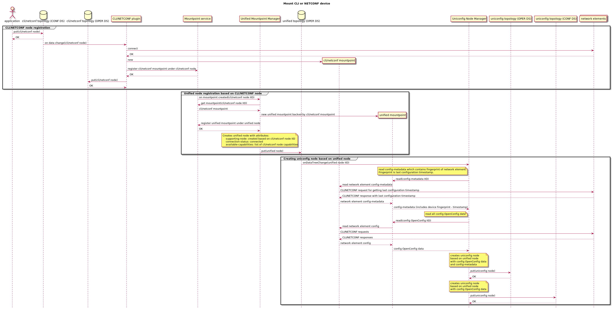
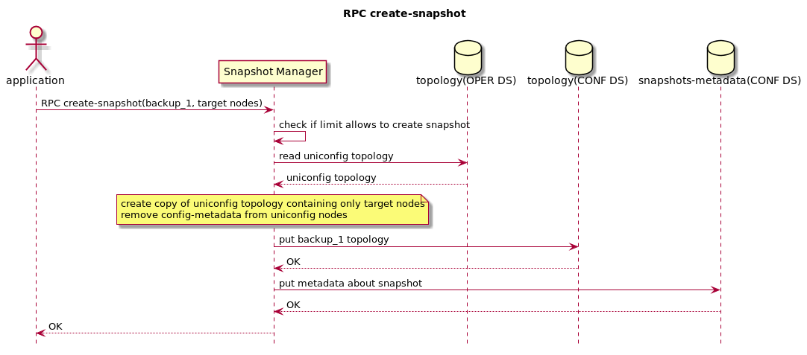
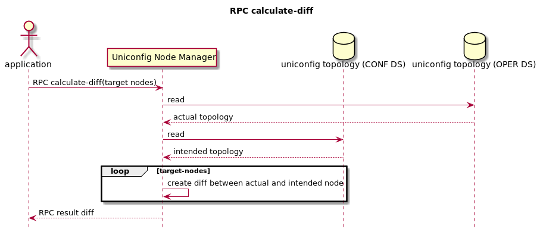
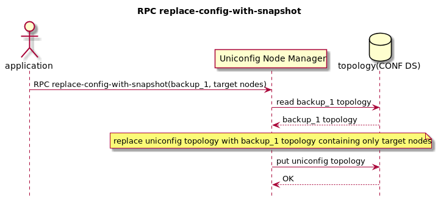

[Documentation main page](https://frinxio.github.io/Frinx-docs/)  
[FRINX Features User Guide main page](https://frinxio.github.io/Frinx-docs/FRINX_ODL_Distribution/Carbon/user_guide.html)  
<!-- TOC -->

- [UniConfig framework](#uniconfig-framework)
    - [Mounting CLI or NETCONF network element](#mounting-cli-or-netconf-network-element)
        - [CLI](#cli)
        - [NETCONF](#netconf)
    - [UniConfig API description](#uniconfig-api-description)
        - [Config initialization](#config-initialization)
        - [RPC sync-from-network](#rpc-sync-from-network)
            - [Example](#example)
        - [RPC commit](#rpc-commit)
            - [Example](#example-1)
        - [RPC create-snapshot](#rpc-create-snapshot)
            - [Example](#example-2)
        - [RPC delete-snapshot](#rpc-delete-snapshot)
            - [Example](#example-3)
        - [RPC calculate-diff](#rpc-calculate-diff)
            - [Example](#example-4)
        - [RPC replace-config-with-operational](#rpc-replace-config-with-operational)
            - [Example](#example-5)
        - [RPC replace-config-with-snapshot](#rpc-replace-config-with-snapshot)
            - [Example](#example-6)

<!-- /TOC -->
This document describes API and use cases how UniConfig framework can be used by
an external or OpenDaylight application.  
[RESTCONF](https://frinxio.github.io/Frinx-docs/FRINX_ODL_Distribution/Carbon/FRINX_Features_User_Guide/restconf.html)
is used for API description and REST call examples in this document.

REST calls used in examples can be downloaded as [uniconfig example postman collection](https://github.com/FRINXio/Postman/blob/carbon/development/Uniconfig%20Framework/uniconfig%20example.postman_collection.json).

[More about OpenDaylight controller and its concepts](http://docs.opendaylight.org/en/stable-carbon/developer-guide/controller.html?highlight=restconf)

# UniConfig framework
[Overview and architecture](../architecture/architecture.md)

## Mounting CLI or NETCONF network element
Mounting CLI or NETCONF network element.



### CLI
More information about CLI mounting can be found [here](https://frinxio.github.io/Frinx-docs/FRINX_ODL_Distribution/Carbon/FRINX_Features_User_Guide/cli/cli-service-module.html#mounting-a-cli-device)

[cli-topology.yang](yang/cli-topology.yang)

[Tree representation of cli-topology.yang](yang/cli-topology.html)

### NETCONF
More information about NETCONF mounting can be found [here](http://docs.opendaylight.org/en/stable-carbon/user-guide/netconf-user-guide.html#southbound-netconf-connector)

[netconf-node-topology.yang](yang/netconf-node-topology.yang)

[Tree representation of netconf-node-topology.yang](yang/netconf-node-topology.html)

[Examples in Postman collection](https://raw.githubusercontent.com/FRINXio/Postman/carbon/development/Uniconfig%20Framework/postman_collection_uniconfig.json)

## UniConfig API description
[uniconfig-manager.yang](yang/uniconfig-manager.yang)

*NOTE: mouse hover on elements in tree representation shows description*

[Tree representation of uniconfig-manager.yang](yang/uniconfig-manager.html)

### Config initialization
Initial reading of network element configuration is triggered when unified
mountpoint is discovered. Reading of data from network element is delegated
to unified mountpoint. Only config data are read from unified mountpoint.
If uniconfig node does not exist in config datastore, that means network
element is discovered for a first time, data is stored under uniconfig node
in config and operational datastore. If uniconfig node already exist
in config datastore, data is stored only to operational datastore.


### RPC sync-from-network
Purpose of this RPC is to synchronize configuration from network
elements to uniconfig nodes in operational datastore.


#### Example
RPC input contains list of uniconfig nodes where configuration should be
refreshed.

RPC request:
```
curl -X POST \
  http://192.168.56.11:8181/restconf/operations/uniconfig-manager:sync-from-network \
  -H 'content-type: application/json' \
  -d '{
    "input": {
        "node-to-sync": [
            {
                "node-id": "IOSXR"
            }
        ]
    }
}'
```

RPC response - success:

```
{
    "output": {
        "node-sync-status-results": {
            "node-sync-status-result": [
                {
                    "nodeId": "IOSXR"
                }
            ]
        }
    }
}
```

### RPC commit
External or ODL application stores intended configuration under nodes
in uniconfig topology. Trigger for execution of configuration is RPC
commit.

[List of supported configuration data](https://github.com/FRINXio/translation-units-docs/tree/master/Configuration%20datasets)

Successful RPC commit is on figure below.


Failed RPC commit with automatic rollback is on figure below.


#### Example
RPC commit has no input and output describes result of commit.

RPC request:
```
curl -X POST \
  http://192.168.56.11:8181/restconf/operations/uniconfig-manager:commit
```

RPC response - success:

```
{
    "output": {
        "overall-configuration-status": "complete",
        "node-config-results": {
            "node-config-result": [
                {
                    "nodeId": "IOSXR",
                    "configuration-status": "complete"
                }
            ]
        }
    }
}
```

### RPC create-snapshot
RPC creates snapshot of uniconfig topology. This snapshot can be used 
for manual rollback.



#### Example
RPC input contains name for topology snapshot. RPC output contains
result of operation.

RPC request:
```
curl -X POST \
  http://192.168.56.11:8181/restconf/operations/uniconfig-manager:create-snapshot \
  -H 'content-type: application/json' \
  -d '{
    "input": {
        "name": "snapshot1"
    }
}'
```

RPC response - success:

```
{
    "output": {
        "result": "complete"
    }
}
```

### RPC delete-snapshot
RPC removes snapshot from CONF DS.


#### Example
RPC input contains name of topology snapshot which should be removed.
RPC output contains result of operation.

RPC request:
```
curl -X POST \
  http://192.168.56.11:8181/restconf/operations/uniconfig-manager:delete-snapshot \
  -H 'content-type: application/json' \
  -d '{
    "input": {
        "name": "snapshot1"
    }
}'
```

RPC response - success:

```
{
    "output": {
        "result": "complete"
    }
}
```

### RPC calculate-diff
This RPC creates diff between actual uniconfig topology and intended
uniconfig topology.



#### Example
RPC input is empty and output contains list of statements representing
diff.

RPC request:
```
curl -X POST \
  http://192.168.56.11:8181/restconf/operations/uniconfig-manager:calculate-diff \
  -H 'accept: application/xml' \
```

RPC response - success:

```
<output xmlns="urn:opendaylight:params:xml:ns:yang:uniconfig:manager">
    <node-with-diff>
        <node-id>IOSXR</node-id>
        <created-data>
            <path xmlns:c="http://frinx.openconfig.net/yang/interfaces" xmlns:b="http://frinx.openconfig.net/yang/uniconfig-topology" xmlns:d="http://frinx.openconfig.net/yang/interfaces/ethernet" xmlns:a="urn:TBD:params:xml:ns:yang:network-topology">/a:network-topology/a:topology[a:topology-id='uniconfig']/a:node[a:node-id='IOSXR']/b:configuration/c:interfaces/c:interface[c:name='GigabitEthernet0/0/0/3']/d:ethernet/d:config</path>
            <data>{
  "frinx-openconfig-if-ethernet:config": {
    "frinx-lacp-lag-member:lacp-mode": "ACTIVE",
    "frinx-lacp-lag-member:interval": "SLOW",
    "frinx-openconfig-if-aggregate:aggregate-id": "Bundle-Ether10",
    "auto-negotiate": true,
    "enable-flow-control": false
  }
}</data>
        </created-data>
    </node-with-diff>
</output>
```

### RPC replace-config-with-operational
RPC replaces uniconfig topology in config datastore with uniconfig
topology from operational datastore.  


#### Example
There is no RPC input and RPC output contains result of operation.

RPC request:
```
curl -X POST \
  http://192.168.56.11:8181/restconf/operations/uniconfig-manager:replace-config-with-operational
```

RPC response - success:

```
{
    "output": {
        "result": "complete"
    }
}
```

### RPC replace-config-with-snapshot
RPC replaces uniconfig topology in config datastore with snapshot from
operational datastore.  



#### Example
RPC input contains name of topology snapshot which should replace uniconfig
topology in config datastore. RPC output contains result of operation.

RPC request:
```
curl -X POST \
  http://192.168.56.11:8181/restconf/operations/uniconfig-manager:replace-config-with-snapshot \
  -H 'content-type: application/json' \
  -d '{
    "input": {
        "name": "snapshot1"
    }
}'
```

RPC response - success:

```
{
    "output": {
        "result": "complete"
    }
}
```
