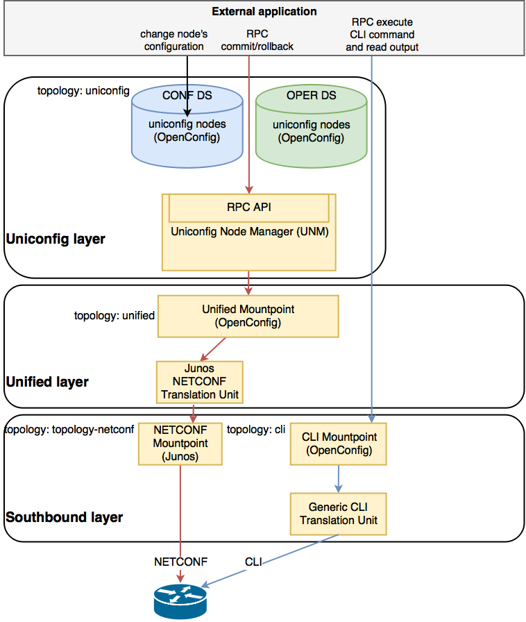

# UniConfig framework components

Figure below shows high level architecture of UniConfig framework, its
components and their dependencies.

UniConfig components use layered design where functionality of upper layers
depends on the functionality of the layer underneath. Each layer thus provides
a higher level of abstraction from the network elements.

Applications are allowed to utilize any of the layers in the system.

There are 3 main layers represented by these components (from top to bottom):

- Uniconfig layer (Uniconfig Node Manager with datastore)
- Unified layer (Unified mountpoint with translation units)
- Southbound layer (NETCONF mountpoint, CLI mountpoint with
translation units)

The datastore is a component in ODL which stores structured data described by
YANG models. There are two separate datastores:

- Config datastore (CONF DS) - contains intended state (intended device
configuration). This datastore is persistent and external (outside ODL)
applications have read/write access.
- Operational datastore (OPER DS) - contains actual state (actual device
configuration). OPER DS is not persistent and external applications have
read only access.

Mountpoints in ODL represent communication interface with an external system.
Mountpoints are usually registered under a node in a topology.

Components are described from bottom to top.

## CLI Mountpoint
A CLI mountpoint provides a management API for a network device over CLI.
OpenConfig models are used for structured data describing the device
configuration and state.
The CLI mounpoint uses CLI translation units for translation between OpenConfig
data and CLI data.
CLI mountpoint API supports device transactions and automatic
rollback functionality (in case an error occurs during device configuration
in device transaction). CLI mountpoint is registered under a node in cli
topology.
Each CLI mountpoint always includes Generic CLI translation unit which provides
RPC for sending raw CLI command and returning raw CLI output.

### CLI Translation Units
A CLI translation unit defines a mapping between YANG models and CLI.
It is used by the Frinx ODL controller to perform translation between
device specific CLI data and standardized structured (OpenConfig YANG) data.
Translation unit can read and write configuration or read state of a device.
It uses CLI over SSH or telnet for communication with CLI device.
Junos and IOS-XR translation units are just simplified examples.
CLI translation unit is usually created for a combination of device type
and OpenConfig main section (folder) e.g. xr-6-network-instance,
xr-6-ospf, ios-local-routing, ios-ospf, etc.

## CLI dry-run Mountpoint
CLI dry-run mountpoint mocks the management API for a network device over CLI.
It uses CLI dry-run journal for storing to-be-executed CLI commands instead
of configuring network device directly. Just as a regular CLI mountpoint,
it uses the same set of CLI translation units and the same set of OpenConfig
YANG models.

### CLI dry-run journal
CLI dry-run journal is used for storing to-be-executed commands from CLI
dry-run mountpoint. Journal is cleared and read by Dry-run Manager.

## NETCONF Mountpoint
NETCONF mountpoint provides a management API for a network device over a NETCONF session.
Data are usually described by a set of vendor specific YANG models. NETCONF
mountpoint provides device transactions (if supported by device).
Automatic rollback may also be supported.
NETCONF mountpoint is registered under a node in topology-netconf topology.

## Unified Mountpoint
Unified mountpoint unifies the API for various southbound protocols like NETCONF
and CLI. The API is described by using OpenConfig YANG models and uses
translation units to translate between OpenConfig data and southbound
mountpoint data. Unified mountpoint is registered under a node in unified
topology.

### Direct Translation Unit
This translation unit does not translate data from one format to the other
because northbound data and southbound data are described by the same
OpenConfig YANG. It can simply pass OpenConfig data to any mountpoint with
OpenConfig available-capabilities.

### NETCONF Translation Unit
NETCONF translation unit translates OpenConfig data to data described by
device specific YANG models. This unit uses NETCONF mountpoint for communication
with a NETCONF device. NETCONF translation unit also implements device transaction
with automatic rollback if it is not provided by the device. The Junos NETCONF
translation unit is a simplified example. NETCONF translation unit is
usually created for a combination of device type and OpenConfig main
section (folder). An example is xr-6-network-instance, xr-6-ospf,
ios-local-routing, ios-ospf, etc.

## Uniconfig Node Manager (UNM)
The responsibility of this component is to maintain configuration on devices
based on intended configuration. Each device and its configuration is
represented as a node in the uniconfig topology and the configuration of this node
is described by using OpenConfig YANG models. The Northbound API of UNM is
RPC driven and provides functionality for commit with automatic rollback,
manual rollback and synchronization of configuration from the network.

When a commit is called, UNM creates a diff based on intended state from
CONFIG DS and actual state from OPER DS. The Diff is used as the basis for device configuration.
UNM prepares a network wide transaction which
uses Unified mountpoints for communication with different types of devices.
In case a configuration on one device fails, UNM executes automatic rollback
where the previous configuration is restored on all modified devices.

Manual rollback enables simple reconfiguration of the entire network
using one of the previous states saved in UNM.

Synchronization from the network reads configuration from devices and stores
it as an actual state to OPER DS.

## Dry-run Manager
The dry-run manager provides functionality for mock configuration of CLI devices where CLI
commands are sent to CLI dry-run journal instead of the device. The dry-run manager uses
Uniconfig Node Manager for getting the diff of intended configuration and
uses CLI dry-run mounpoint for sending CLI commands to dry-run journal.

# Components interactions
Figures show interactions in UniConfig triggered by an external application.

## NETCONF device configuration
UniConfig uses NETCONF for device configuration. An external application can
also use CLI RPC from Generic CLI translation unit for direct communication.
The device is firstly mounted as a node to *topology-netconf* and then to topology *cli*.

## CLI device configuration
UniConfig uses CLI for device configuration. An external application can
also use CLI RPC for direct communication and CLI dry-run. The device is
mounted as a node in topology *cli*.

# Topologies
The UniConfig framework uses various topologies on different layers.
Each topology contains nodes in the CONF and OPER datastores.

## CLI
The cli topology contains nodes which are connected with ODL via CLI.
A node in CONF DS contains information how the ODL controller should connect
to CLI devices (i.e. IP address, port, username, password, etc.) and
a node in OPER DS contains the state of connection with available-capabilities.
CLI mountpoints are registered under these nodes. Configuration and
state on the device can be obtained from mountpoint.

## NETCONF
The topology-netconf topology contains nodes which are connected with ODL through
NETCONF. A node in CONF DS contains information on how the ODL controller should connect
to NETCONF devices (i.e. IP address, port, username, password, etc.) and
a node in OPER DS contains the state of connection with available-capabilities.
NETCONF mountpoints are registered under these nodes. Configuration and
state on the device can be obtained from mountpoint.

## Unified
A node in unified topology only contains data about connection state and
available-capabilities in OPER DS. Unified mountpoints are registered
under these nodes.

## Uniconfig
Nodes in uniconfig topology contain the entire configuration of devices.
A node in CONF DS describes the intended configuration and the same node in
OPER DS shows actual device configuration.

# Deployment
The UniConfig framework can be deployed on a single node (PC, laptop, VM, docker
container) or on multiple nodes (servers, VMs, docker containers) as a cluster.

## Single node
In the most simple deployment case, all applications run on a single node. This
deployment is usually used during the development phase or PoC and might be used
when the application functionality and behaviour is being tested. After the node is
restarted only CONFIG DS is restored.

## Clustering
Clustered deployment usually use 3 nodes. This deployment provides high availability
(HA) because data is replicated on each node. UniConfig framework runs
on all nodes but is only in active state on one and on the rest of the nodes is in
standby state. When an active node goes down or becomes unreachable to other
nodes, one of the standby nodes becomes active. This deployment can handle only
one node being lost. After the down node is running again it will automatically join
the cluster and synchronize itself. If all nodes are restarted only CONFIG DS is restored.
