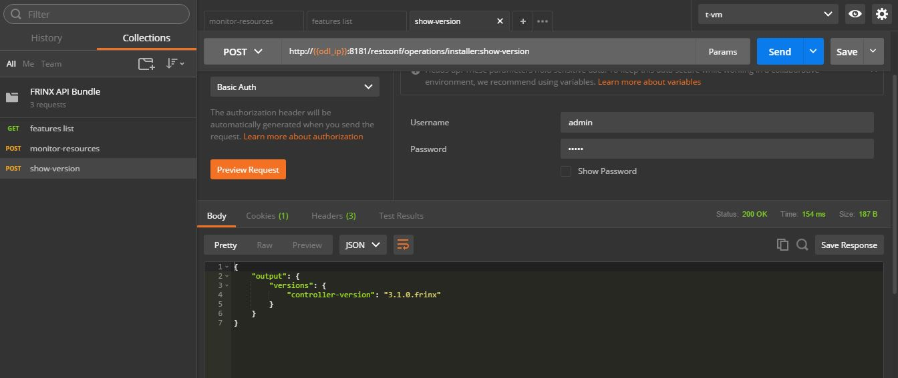
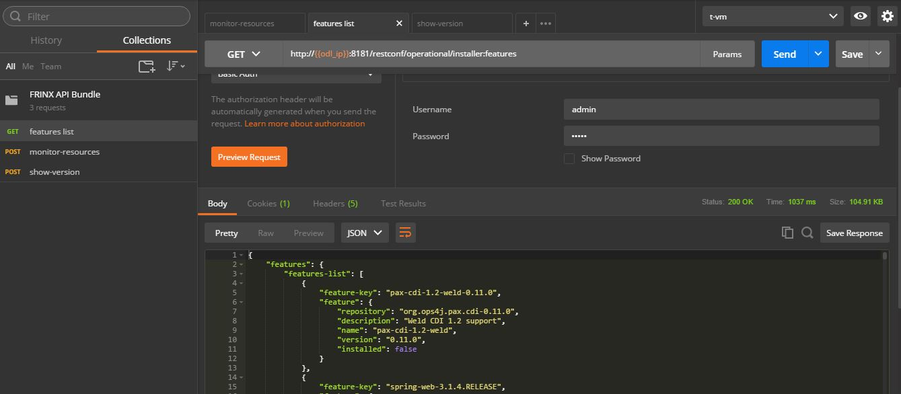
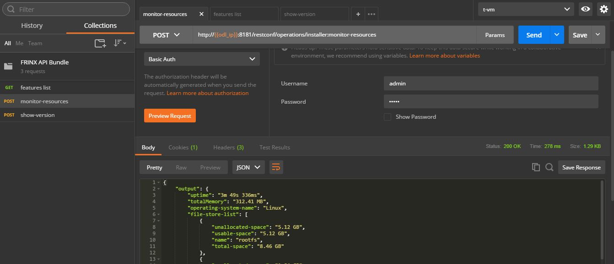

[Documentation main page](https://frinxio.github.io/Frinx-docs/)
[FRINX Features User Guide main page](https://frinxio.github.io/Frinx-docs/FRINX_ODL_Distribution/Carbon/user_guide.html)
<!-- TOC -->

- [Using the FRINX API Bundle](#using-the-frinx-api-bundle)
    - [Show version](#show-version)
    - [Features list](#features-list)
    - [Monitor resources](#monitor-resources)
    - [Upload a KAR file](#upload-a-kar-file)

<!-- /TOC -->
# Using the FRINX API Bundle

To use this functionality, run the following command in the karaf console:

    feature:install frinx-installer-backend

The API is based on REST services. This means that functionality can be tested using CURL. This bundle consists of 4 services listed in the sections that follow.

The easiest way to issue the REST calls detailed below is using Postman and our preconfigured REST calls packaged  - see our [usage guide](../API.md). Follow the guide to import the file `postman_collection_FRINX API Bundle.json` from within the directory `Infrastructure`.

## Show version

This displays the current Karaf distribution version. For example:

By REST (as POST). (username: admin password: admin). This can be done in Postman.

    http://[host]:[port]/restconf/operations/installer:show-version

Postman example:

Or typing the following in a terminal window:

    curl 'http://localhost:8181/restconf/operations/installer:show-version' -H 'Host: localhost:8181' -H 'Content-Type: application/json;charset=utf-8' -H 'Authorization: Basic YWRtaW46YWRtaW4=' -X post

Gives the following output:

    {"output":{"versions":{"controller-version":"1.2.6.frinx-SNAPSHOT"}}}

## Features list

This allows a list of features to be extracted without starting up karaf. Each feature must have the following properties:

name - version - repository - description - installed (boolean value, whether it is installed or not)

For example:

By REST (as GET). (username: admin password: admin). This can be done in Postman.

    http://[host]:[port]/restconf/operational/installer:features

Postman example:

Or typing the following in a terminal window:

    curl 'http://localhost:8181/restconf/operational/installer:features' -H 'Host: localhost:8181' -H 'Accept: application/json, text/plain, */*' -H 'Accept-Language: en-US,en;q=0.5' -H 'Authorization: Basic YWRtaW46YWRtaW4=' -X get

Gives the following output:

    { "features":{ "features-list":[ { "feature-key":"odl-aaa-authz-0.3.2-Beryllium-SR2.3-frinxodl-SNAPSHOT", "feature":{ "installed":false, "name":"odl-aaa-authz", "description":"OpenDaylight :: AAA :: Authorization", "version":"0.3.2-Beryllium-SR2.3-frinxodl-SNAPSHOT", "repository":"odl-aaa-0.3.2-Beryllium-SR2.3-frinxodl-SNAPSHOT" } }, { "feature-key":"odl-config-core-0.4.2-Beryllium-SR2.2-frinxodl", "feature":{ "installed":false, "name":"odl-config-core", "description":"OpenDaylight :: Config :: Core", "version":"0.4.2-Beryllium-SR2.2-frinxodl", "repository":"odl-config-0.4.2-Beryllium-SR2.2-frinxodl" } }, { "feature-key":"config-3.0.3.11-frinxkaraf", "feature":{ "installed":true, "name":"config", "description":"Provide OSGi ConfigAdmin support", "version":"3.0.3.11-frinxkaraf", "repository":"standard-3.0.3.11-frinxkaraf" } }, { "feature-key":"odl-openflowplugin-app-config-pusher-0.2.2-Beryllium-SR2.3-frinxodl-SNAPSHOT", "feature":{ "installed":false, "name":"odl-openflowplugin-app-config-pusher", "description":"OpenDaylight :: Openflow Plugin :: app - default config-pusher", "version":"0.2.2-Beryllium-SR2.3-frinxodl-SNAPSHOT", "repository":"openflowplugin-0.2.2-Beryllium-SR2.3-frinxodl-SNAPSHOT" } }, { "feature-key":"odl-config-netty-config-api-0.4.2-Beryllium-SR2.2-frinxodl", "feature":{ "installed":false, "name":"odl-config-netty-config-api", "description":"OpenDaylight :: Config :: Netty Config API", "version":"0.4.2-Beryllium-SR2.2-frinxodl", "repository":"odl-config-0.4.2-Beryllium-SR2.2-frinxodl" } }, { "feature-key":"odl-mdsal-all-1.3.2-Beryllium-SR2.3-frinxodl-SNAPSHOT", "feature":{ "installed":false, "name":"odl-mdsal-all", "description":"OpenDaylight :: MDSAL :: All", "version":"1.3.2-Beryllium-SR2.3-frinxodl-SNAPSHOT", "repository":"odl-mdsal-1.3.2-Beryllium-SR2.3-frinxodl-SNAPSHOT" } }, { "feature-key":"odl-mdsal-clustering-1.3.2-Beryllium-SR2.2-frinxodl", "feature":{ "installed":false, "name":"odl-mdsal-clustering", "description":"", "version":"1.3.2-Beryllium-SR2.2-frinxodl", "repository":"odl-mdsal-1.3.2-Beryllium-SR2.2-frinxodl" } } ] } }

## Monitor resources

This displays base information about system, memory and disk management

For example:

By REST (as POST). (username: admin password: admin). This can be done in Postman.

    http://[host]:[port]/restconf/operations/installer:monitor-resources

Postman example:

Or typing the following in a terminal window:
    curl 'http://localhost:8181/restconf/operations/installer:monitor-resources' -H 'Host: localhost:8181' -H 'Content-Type: application/json;charset=utf-8' -H 'Authorization: Basic YWRtaW46YWRtaW4=' -X post

Gives the following output:

    { "output":{ "file-store-list":[ { "unallocated-space":"2.58 GB", "name":"udev", "total-space":"2.58 GB", "usable-space":"2.58 GB" }, { "unallocated-space":"530.83 MB", "name":"tmpfs", "total-space":"531.88 MB", "usable-space":"530.83 MB" }, { "unallocated-space":"49.13 GB", "name":"/dev/sda1", "total-space":"104.05 GB", "usable-space":"43.82 GB" }, { "unallocated-space":"4.00 KB", "name":"none", "total-space":"4.00 KB", "usable-space":"4.00 KB" }, { "unallocated-space":"5.00 MB", "name":"none", "total-space":"5.00 MB", "usable-space":"5.00 MB" }, { "unallocated-space":"2.60 GB", "name":"none", "total-space":"2.60 GB", "usable-space":"2.60 GB" }, { "unallocated-space":"100.00 MB", "name":"none", "total-space":"100.00 MB", "usable-space":"100.00 MB" }, { "unallocated-space":"100.00 KB", "name":"cgmfs", "total-space":"100.00 KB", "usable-space":"100.00 KB" }, { "unallocated-space":"49.13 GB", "name":"/dev/sda1", "total-space":"104.05 GB", "usable-space":"43.82 GB" }, { "unallocated-space":"531.88 MB", "name":"tmpfs", "total-space":"531.88 MB", "usable-space":"531.88 MB" } ], "vm-vendor":"Oracle Corporation", "availableProcessors":2, "operating-system-name":"Linux", "uptime":"1days 45m 31s 285ms", "freeMemory":"422.21 MB", "maxMemory":"1.78 GB", "start-time":"2016-08-24 15:39:06.512", "totalMemory":"799.50 MB", "vm-version":"25.91-b14", "vm-name":"OpenJDK 64-Bit Server VM", "operating-system-version":"4.4.0-34-generic" } }

## Upload a KAR file

This function allows the user to easily upload any KAR file to the Karaf distribution. Before installing, the KAR file is validated. There is an HTTP servlet which listens on

    http://[host]:[port]/kar-uploader

The POST request contains one parameter which indicates the binary data of the KAR file. The parameter should be specified in [base64 binary data format][1] (as in the example curl command below).

For example the CURL has a function to convert file location to binary data. You can upload a KAR file by typing the following in a terminal:

    curl 'http://localhost:8181/restconf/operations/installer:upload-kar' -H 'Host: localhost:8181' -H 'Content-Type: application/yang.data+json;charset=utf-8' -H 'Authorization: Basic YWRtaW46YWRtaW4=' -X post -d '{"input":{"data":"'"$(base64 --wrap=0 upload/dummy-1.0.0.kar)"'"}}' -H 'Connection: keep-alive' -H "Expect:"

*where upload/dummy-1.0.0.kar is the path of the KAR file to be uploaded*

This will give the following output which confirms that the file has been uploaded correctly:

    {
       "output":{
          "outcome":"Data was successfully uploaded. Length of file is: 7456 bytes"
       }
    }

*The postman collection for the Frinx API Bundle can be downloaded from [here](https://github.com/FRINXio/Postman/releases).* 

| Feature Guide         |             |                   |
|-----------------------|-------------|-------------------|
| Feature introduced in | FRINX 1.2.6 | API bundle module |

 [1]: https://tools.ietf.org/html/rfc6020#section-9.8.2
