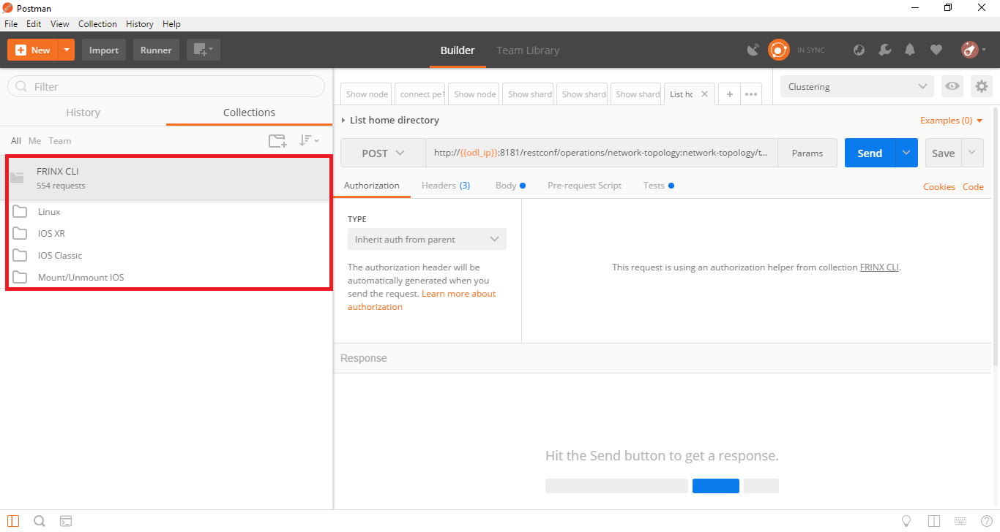
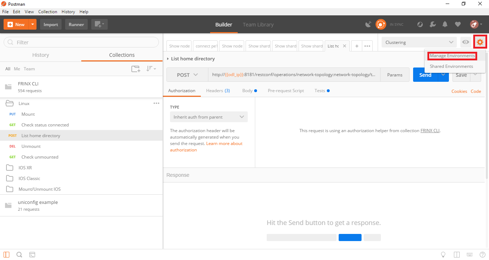
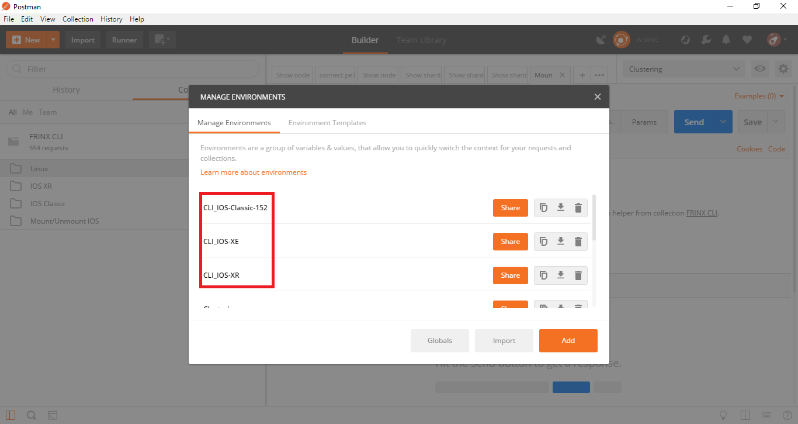

[Documentation main page](https://frinxio.github.io/Frinx-docs/)  
# API - Postman
<!-- TOC -->

- [Download Postman (free)](#download-postman--free-)
- [Download FRINX Postman collection and environment files](#download-frinx-postman-collection-and-environment-files)
- [Importing FRINX Postman collection & environment files into Postman](#importing-frinx-postman-collection---environment-files-into-postman)
  * [Configuring environments](#configuring-environments)
  * [Activating an environment](#activating-an-environment)
- [Versioning](#versioning)
  * [Main releases](#main-releases)
  * [Release candidates](#release-candidates)
  * [Backwards compatibility](#backwards-compatibility)
- [Swagger](#swagger)
  * [Uniconfig REST API documented with OpenAPI v2](#uniconfig-rest-api-documented-with-openapi-v2)
  * [Uniconfig client code generated from OpenAPI definition available for Python and Go clients](#uniconfig-client-code-generated-from-openapi-definition-available-for-python-and-go-clients)
  * [Unified REST API documented with OpenAPI v2](#unified-rest-api-documented-with-openapi-v2)
  * [Unified client code generated from OpenAPI definition available for Python and Go clients](#unified-client-code-generated-from-openapi-definition-available-for-python-and-go-clients)
  * [Southbound REST API documented with OpenAPI v2](#southbound-rest-api-documented-with-openapi-v2)
  * [Southbound client code generated from OpenAPI definition available for Python and Go clients](#southbound-client-code-generated-from-openapi-definition-available-for-python-and-go-clients)
    + [How to launch Swagger-UI](#how-to-launch-swagger-ui)

<!-- /TOC -->
## Download Postman (free)
FRINX uses the free Postman REST client as an API for the FRINX ODL distribution. [Download Postman for your system](https://www.getpostman.com/postman)

## Download FRINX Postman collection and environment files
We have created collections of REST calls that form the API for the FRINX ODL distribution.
These REST calls are grouped together as **Postman collection** files. 

For some features we also provide **Postman environment** files (with suffix env.json). These make the REST calls easily configurable through the use of variables, whose values you can edit (see section below in importing).

Both the FRINX **Postman collection** and **Postman environment** files are grouped by FRINX ODL release (starting with 3.1.1) and packaged as zip files [here](https://github.com/FRINXio/Postman/releases). 

On that page, find your FRINX ODL version number and click on 'zip' to download to a location on your local machine. 

  

In a terminal on your local machine, unzip the file. This will create a new directory with the 
following subdirectories, grouped by FRINX ODL features: 

* `Infrastructure`          - [Bundle API](FRINX_Features_User_Guide/using-the-frinx-api-bundle.md), [Clustering](Operations_Manual/clustering-overview)
* `Uniconfig Framework`     - [CLI](FRINX_Features_User_Guide/cli/cli-service-module.md), [Uniconfig](FRINX_Features_User_Guide/uniconfig/architecture/architecture.md)  

## Importing FRINX Postman collection & environment files into Postman
Start Postman and click on **Import** near the top-left of the screen.

In the pop-up window which opens, click **Choose files** and navigate into the subdirectory of your choice (Infrastructure and Uniconfig Framework) and select a postman_collection.json file to import (both collection files and environment files are imported from here). 

  

Imported **Collection files** appear as folders on the left of the screen. They contain sets of REST calls which allow you to interact with FRINX ODL and to use FRINX ODL to interact with network devices.

  

### Configuring environments
The advantage of setting environments is that you can re-use the same variable name throughout the URL and body of multiple calls, and update its value in one location.

You can create your own environments, but you can also make use of environments we have created to save time. You can re-use our keys, but you will need to update the values according to your setup:

Imported **Environment files** contain variables whose values you can update by clicking on the cog icon near the top-right of Postman and selecting **Manage Environments**.  

  

All the environments you have imported or created will be listed:  

  

CLick on the environment you wish to edit. You are then able to set values for each key (variable):

  

Click on **Update** to save your changes.

### Activating an environment
Next you need to select your choice of environment from the drop-down menu in the top right of screen:

   

The value you set for each key when you configured the selected environment is substituted for the key wherever it appears within the body or URL of any REST call you issue while that environment is active. When using keys within calls, they should be encapsulated in double sets of curly braces (our postman collection calls are already set up this way):

   

## Versioning
### Main releases
Distinct versions of the FRINX Postman API files are [available here](https://github.com/FRINXio/Postman/releases), and named in the following format to correspond to analogous FRINX ODL distributions:  

    release-x.x.x.frinx  

for example 

    release-3.1.1.frinx

### Release candidates
Between releases we also publish release candidate (RC) zip files [in the same location](https://github.com/FRINXio/Postman/releases) which are pre-release versions in the development stage. These correspond with pre-release versions of FRINX ODL. The naming format is:  

    release-x.x.x.rcx-frinx

for example

    release-3.1.1.rc2-frinx

### Backwards compatibility
Backwards compatibility of FRINX Postman collections:   
`Infrastructure`        - Works with all releases of Oxygen, Carbon, Boron, Beryllium FRINX ODL  
`Uniconfig Framework`   - Works only with corresponding version of FRINX ODL  

## Swagger

Swagger is a framework backed by a large ecosystem of tools that helps developers to work with RESTful Web services. The Swagger toolset includes support for automated documentation, code generation, and test-case generation.

Following files provide OpenAPI files for FRINX ODL’s REST interface (in context of uniconfig topology, unified topology and southbound topology) which can be used with Swagger tools.

---

### Uniconfig REST API documented with OpenAPI v2

 - OpenAPI document generated from Uniconfig model + Openconfig models

**Download** document here:

[https://license.frinx.io/download/swagger-uniconfig-4.2.0.frinx.zip](https://license.frinx.io/download/swagger-uniconfig-4.2.0.frinx.zip)

---

### Uniconfig client code generated from OpenAPI definition available for Python and Go clients

 - Client code library, encapsulating REST calls no available for external applications interacting with Uniconfig

**Download** Python code library: 

[https://license.frinx.io/download/swagger-uniconfig-python-4.2.0.frinx.zip](https://license.frinx.io/download/swagger-uniconfig-python-4.2.0.frinx.zip)

**Download** Go code library: 

[https://license.frinx.io/download/swagger-uniconfig-go-4.2.0.frinx.zip](https://license.frinx.io/download/swagger-uniconfig-go-4.2.0.frinx.zip)

---

### Unified REST API documented with OpenAPI v2

 - OpenAPI document generated from Unified topology model + Openconfig models

**Download** document here:

[https://license.frinx.io/download/swagger-unified-4.2.0.frinx.zip](https://license.frinx.io/download/swagger-unified-4.2.0.frinx.zip)

---

### Unified client code generated from OpenAPI definition available for Python and Go clients

 - Client code library, encapsulating REST calls no available for external applications interacting with unified topology

**Download** Python code library: 

[https://license.frinx.io/download/swagger-unified-python-4.2.0.frinx.zip](https://license.frinx.io/download/swagger-unified-python-4.2.0.frinx.zip)

**Download** Go code library: 

[https://license.frinx.io/download/swagger-unified-go-4.2.0.frinx.zip](https://license.frinx.io/download/swagger-unified-go-4.2.0.frinx.zip) 

---

### Southbound REST API documented with OpenAPI v2

 - OpenAPI document generated from Cli tipology + Netconf topology models

**Download** document here:

[https://license.frinx.io/download/swagger-southbound-4.2.0.frinx.zip](https://license.frinx.io/download/swagger-southbound-4.2.0.frinx.zip)

---

### Southbound client code generated from OpenAPI definition available for Python and Go clients

 - Client code library, encapsulating REST calls no available for external applications interacting with southbound (cli and netconf topology)

**Download** Python code library:

[https://license.frinx.io/download/swagger-southbound-python-4.2.0.frinx.zip](https://license.frinx.io/download/swagger-southbound-python-4.2.0.frinx.zip)

**Download** Go code library: 

[https://license.frinx.io/download/swagger-southbound-go-4.2.0.frinx.zip](https://license.frinx.io/download/swagger-southbound-go-4.2.0.frinx.zip)

---

Example LACP service implementation using generated Swagger based client code can be found in the link below:
    
[https://github.com/FRINXio/Lacp-service-labdocs](https://github.com/FRINXio/Lacp-service-labdocs)

#### How to launch Swagger-UI

1. Download swagger-uniconfig-4.2.0.frinx.zip (The first download link on top)

2. Unzip the file

3. Go to the directory which you extracted the file in

4. Run following command in your terminal:

```
sudo docker run -p 80:8080 -e SWAGGER_JSON=/foo/uniconfig.yaml -v $PWD:/foo swaggerapi/swagger-ui
```

5. Open your browser and visit: localhost

