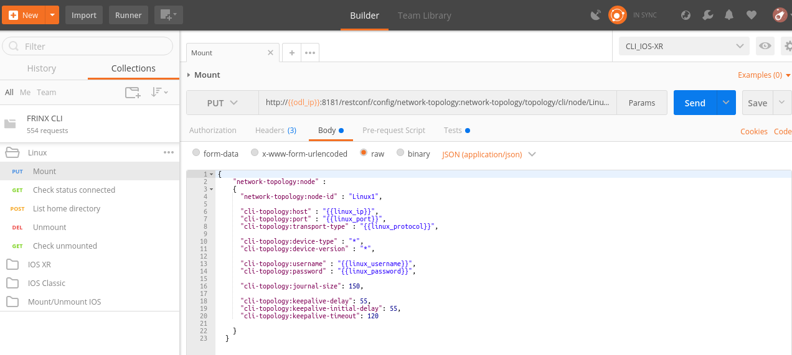
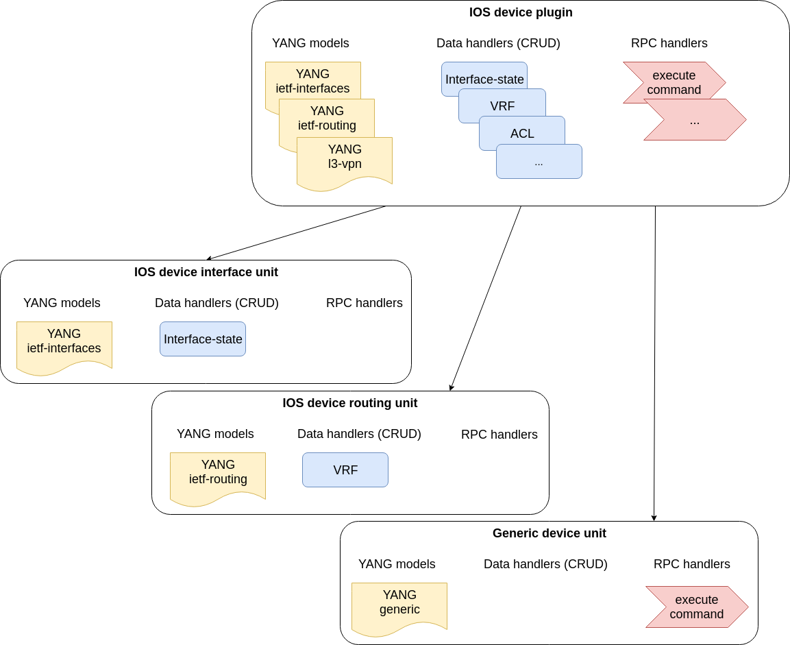
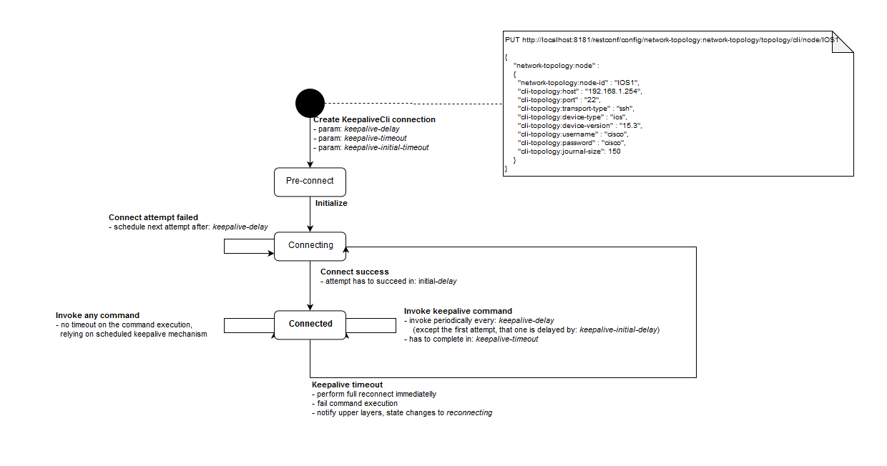
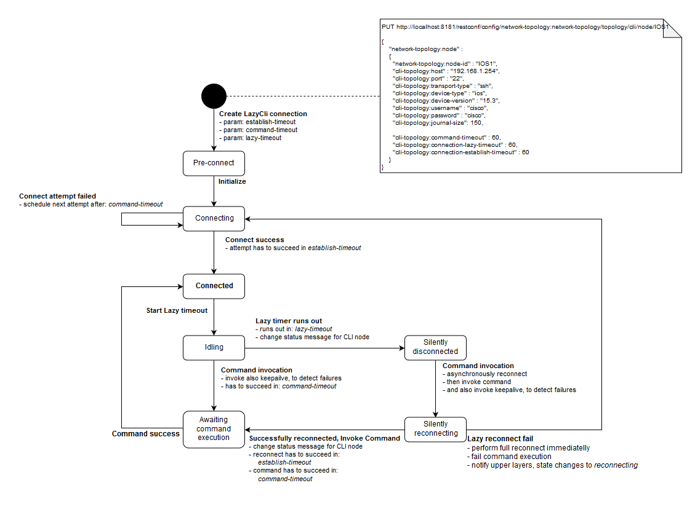

[Documentation main page](https://frinxio.github.io/Frinx-docs/)
[FRINX Features User Guide main page](https://frinxio.github.io/Frinx-docs/FRINX_ODL_Distribution/Oxygen/user_guide.html)
# CLI Service Module User Guide

Table of Contents:

- [CLI Service Module User Guide](#cli-service-module-user-guide)
  * [Usage - Setup](#usage---setup)
    + [FRINX ODL - Install features](#frinx-odl---install-features)
    + [Optional - Change logging level](#optional---change-logging-level)
    + [Postman - Import collection](#postman---import-collection)
  * [Introduction](#introduction)
  * [Usage - Operations Guide](#usage---operations-guide)
    + [Mounting a CLI device](#mounting-a-cli-device)
      - [How to mount and manage IOS devices over REST](#how-to-mount-and-manage-ios-devices-over-rest)
      - [How to mount and manage generic Linux VM devices over REST](#how-to-mount-and-manage-generic-linux-vm-devices-over-rest)
      - [Pushing a config to a mounted node in dry run mode](#pushing-a-config-to-a-mounted-node-in-dry-run-mode)
  * [Architecture](#architecture)
    + [CLI topology](#cli-topology)
      - [APIs](#apis)
    + [CLI mountpoint](#cli-mountpoint)
      - [APIs](#apis-1)
      - [Translation layer](#translation-layer)
        * [Device specific translation plugin](#device-specific-translation-plugin)
          + [Units](#units)
      - [Transport layer](#transport-layer)
  * [Data processing](#data-processing)
    + [Transactions and revert](#transactions-and-revert)
    + [Reconciliation](#reconciliation)
  * [Supported devices](#supported-devices)
  * [Strategies to connect to CLI devices](#strategies-to-connect-to-cli-devices)
    + [KeepaliveCli mechanism](#keepalivecli-mechanism)
    + [LazyCli mechanism](#lazycli-mechanism)

## Usage - Setup
### FRINX ODL - Install features
[Run FRINX ODL](../../Operations_Manual/running-frinx-odl-initial.html).

Subsequently, install the required features within karaf:

    feature:install cli-topology cli-southbound-all-units odl-restconf

This installs the CLI topology and all supported CLI translation units for various platforms like for instance IOS, IOS-XR, Huawei VRP, and Brocade Ironware.

### Optional - Change logging level
If you require more detailed logging, run the following command in the karaf terminal, to enable DEBUG/TRACE logging:

    log:set DEBUG io.frinx.cli

### Postman - Import collection
First follow the instructions [here](../../API.md) to download and use FRINX pre-configured Postman REST calls.

You'll be able to select the FRINX API version that maps to the version of FRINX ODL you are using. The `Uniconfig Framework` subdirectory contains the files needed to interact with the CLI.

The sections below (after the Introduction) provide samples of how the CLI southbound plugin can be used to manage a particular device.

## Introduction
The CLI southbound plugin enables the FRINX Opendaylight distribution to communicate with CLI devices that do not speak NETCONF or any other programmatic API. The CLI service module uses YANG models and implements a translation logic to send and receive structured data to and from CLI devices. This allows applications to use a service model or unified device model to communicate with a broad range of network platforms and SW revisions from different vendors.

Much like the NETCONF southbound plugin, the CLI southbound plugin enables fully model-driven, transactional device management for internal and external OpenDaylight applications. In fact, the applications are completely unaware of underlying transport and can manage devices over the CLI plugin in the same exact way as over NETCONF.

Once we have mounted the device, we can present an abstract, model-based network device and service interface to applications and users. For example, we can parse the output of an IOS command and return structured data.


## Usage - Operations Guide
### Mounting a CLI device
The following is an overview of the process by which a CLI device is rendered truly accessible for users and applications:

1.  Submit CLI device configuration into CLI topology
    *   Over REST, NETCONF or from within Opendaylight
2.  CLI topology opens transport layer by opening a session with the device
3.  CLI topology collects all the units into a plugin and instantiates translation layer
4.  CLI topology builds mountpoint services on top of the translation layer
5.  CLI topology exposes the mountpoint into MD-SAL
6.  CLI topology updates operational state of this node in CLI topology to connected

You can achieve this as follows:

#### How to mount and manage IOS devices over REST
The easiest way is to use one of the REST calls FRINX has already created and packaged in the [FRINX API](../../API.md).
The **FRINX UNIFIED** postman collection (`postman_collection_unified.json`) accessible via that link is  contained within the `Uniconfig Framework` directory of the download. It can be imported into Postman and contains subfolders with collections for various devices e.g. **IOS XR**, **IOS Classic**, **Junos**.  

These contain subfolders **XR Mount**, **Classic Mount** and **Junos Mount** respectively, with pre-configured calls for mounting those devices. As explained [here](../../API.md) you will need to import the relevant environment file and update its variables - this is because the calls contains several of these variables (visible in double sets of curly braces in the following image)

Once mounted, several other operations can be undertaken using the calls contained within the other Postman collection subfolders e.g. *General Information, Interface, static route*.

**Example**
Mounting of CISCO IOS-XR device as CLI node.

Using Postman:  


Using Curl:  

RPC request:  

```
curl -X PUT \
  http://192.168.56.11:8181/restconf/config/network-topology:network-topology/topology/cli/node/IOSXR \
  -H 'content-type: application/json' \
  -d '{
    "network-topology:node" :
    {
      "network-topology:node-id" : "IOSXR",
      "cli-topology:host" : "192.168.1.211",
      "cli-topology:port" : "22",
      "cli-topology:transport-type" : "ssh",
      "cli-topology:device-type" : "ios xr",
      "cli-topology:device-version" : "5.3.4",
      "cli-topology:username" : "cisco",
      "cli-topology:password" : "cisco",
      "cli-topology:secret" : "cisco",
      "cli-topology:keepalive-delay": 30,
      "cli-topology:keepalive-timeout": 30,
      "cli-topology:journal-size": 150,
      "cli-topology:dry-run-journal-size": 150
    }
  }'
```
**Description of parameters:**  

"network-topology:node-id" : "IOSXR_F",  // name of node representing device  
"cli-topology:host" : "10.0.0.203",  // IP address of device  
"cli-topology:port" : "22",  // port on device  
"cli-topology:transport-type" : "ssh",  // transport for CLI - "ssh" or "telnet"  
"cli-topology:device-type" : "ios xr", // device type: "ios xr" "junos" "ios"  
"cli-topology:device-version" : "5.3.4",  // version of device. Use a specific version or "*" for a generic one. "*" enables only basic read and write management without the support of openconfig models
"cli-topology:username" : "ios",  // username for CLI  
"cli-topology:password" : "ios",  // password for CLI, also used for entering privileged mode on cisco devices  
"cli-topology:secret" : "cisco", // used for entering privileged mode on cisco devices  
"cli-topology:keepalive-delay": 30, // send keepalive every 30 seconds  
"cli-topology:keepalive-timeout": 30, // close connection if keepalive response is not received within 30 seconds  
"node-extension:reconcile": false,  // read device configuration after connection is created to fill in the cache  
"cli-topology:journal-size": 150,  // number of commands in command history  
"cli-topology:dry-run-journal-size": 150 // creates dry-run mountpoint and defines number of commands in command history for dry-run mountpoint  

**Privileged mode**  

When you mount a device, you can also specify its password/secret which is used (mostly on Cisco devices) to access privileged mode. This can be done by including the following additional parameter to the REST call when mounting a device: 

~~~~
"cli-topology:secret": "cisco" 
~~~~

By default, if a Cisco device is not in privileged mode when connected to, the secret is used to enter privileged mode. If there is no secret set, the "password" will be used.

**Mounting from an application**  

IOS devices can also be mounted and managed from an application. For instructions, please see the end of the [Developer Guide](../../FRINX_Features_Developer_Guide/cli/cli-service-module-devguide.html)

#### How to mount and manage generic Linux VM devices over REST
It is possible to mount any network device as a generic device. This allows invocation of any commands on the device using RPCs, which return the output back as freeform data and it is up to the user/application to make sense of them.

In postman, open the folder **Linux** to access the Mount call. To configure the variable values, import the `linux_157_env.json` environment file from the `Uniconfig Framework` directory as explained in the [FRINX API guide](../../API.md)



#### Pushing a config to a mounted node in dry run mode
To operate in dry-run mode (useful for testing or demo purposes), you can use one of the Mount cli calls within the imported **FRINX UNIFIED** postman collection (**IOS XR/XR Mount/Mount IOS XR cli** or **IOS Classic/Classic Mount/Mount IOS Classic**).

- First change the values of the following lines within the body of the call to the following:  

~~~~
{
    "network-topology:node" :
    {
      "network-topology:node-id" : "IOS",

      "cli-topology:host" : "",
      "cli-topology:port" : "22",
      "cli-topology:transport-type" : "ssh",

      "cli-topology:device-type" : "ios",
      "cli-topology:device-version" : "15.2",

      "cli-topology:username" : "cisco",
      "cli-topology:password" : "cisco",

      "cli-topology:journal-size": 150,
      "cli-topology:dry-run-journal-size": 180
    }
}
~~~~

-  Now issue the call, but in the URL instead of using node id, use node-id-dryrun e.g. IOS1-dryrun.

## Architecture
This section provides an architectural overview of the plugin, focusing on the main conponents.

### CLI topology
The CLI topology is a dedicated topology instance where users and applications can:

*   mount a CLI device
*   unmount a device
*   check the state of connection
*   read/write data from/to a device
*   execute RPCs on a device

In fact, this topology can be seen as an equivalent of topology-netconf, providing the same features for netconf devices.

#### APIs
The topology APIs are YANG APIs based on the ietf-topology model. Similarly to netconf topology, CLI topology augments the model with some basic configuration data and also some state to monitor mountpoints. For details please refer to the latest CLI topology YANG model.

### CLI mountpoint
The plugin relies on MD-SAL and its concept of mountpoints to expose management of a CLI device into Opendaylight. By exposing a mountpoint into MD-SAL, it enables the CLI topology to actually access the device's data in a structured/YANG manner. Components of such a mountpoint can be divided into 3 distinct layers:

*   Service layer - implementation of MD-SAL APIs delegating execution to transport layer.
*   Translation layer - a generic and extensible translation layer. The actual translation between YANG and CLI takes place in the extensions. The resulting CLI commands are then delegated to transport layer.
*   Transport layer - implementation of various transport protocols used for actual communication with network devices.

The following diagram shows the layers of a CLI mountpoint:


#### APIs
The mountpoint exposes standard APIs and those are:

*   DataBroker
*   RpcService
*   NotificationService (optionally) 

These are the basic APIs every mountpoint in MD-SAL needs to provide. The actual data consumed and provided by the services depends on the YANG models implemented for a particular device type.

#### Translation layer
The CLI southbound plugin is as generic as possible. However, the device-specific translation code (from YANG data -> CLI commands and vice versa), needs to be encapsulated in a device-specific translation plugin. E.g. Cisco IOS specific translation code needs to be implemented by Cisco IOS translation plugin before Opendaylight can manage IOS devices. These translation plugins in conjunction with the generic translation layer allow for a CLI mountpoint to be created.

##### Device specific translation plugin
Device specific translation plugin is a set of: 

- YANG models  
- Data handlers  
- RPC implementations

that actually

*   defines the model/structure of the data in Opendaylight
*   implements the translation between YANG data and device CLI in a set of handlers
*   (optionally) implements the translation between YANG rpcs and device CLI

So the plugin itself is responsible for defining the mapping between YANG and CLI. However, the translation layer into which it plugs in is what handles the heavy lifting for it e.g. transactions, rollback, config data storage, reconciliation etc. Additionally, the SPIs of the translation layer are very simple to implement because the translation plugin only needs to focus on the translations between YANG <-> CLI.

###### Units
In order to enable better extensibility of the translation plugin and also to allow the separation of various aspects of a device's configuration, a plugin can be split into multiple units. Where a unit is actually just a subset of a plugin's models, handlers and RPCs.

A single unit will usually cover a particular aspect of device management e.g. the interface management unit.

Units can be completely independent or they can build on each other, but in the end (in the moment where a device is being mounted) they form a single translation plugin.

Each unit has to be registered under a specific device type(s) e.g. an interface management unit could be registered for various versions of the IOS device type. When mounting an IOS device, the CLI southbound plugin collects all the units registered for the IOS device type and merges them into a single plugin enabling full management.

The following diagram shows an IOS device translation plugin split into multiple units:



#### Transport layer
There are transport protocols available such as:

*   SSH
*   Telnet

They implement the same APIs, which enables the translation layer of the CLI plugin to be completely independent of the underlying protocol in use. Deciding which transport will be used to manage a particular device is simply a matter of configuration.

## Data processing
There are 2 types of data in the Opendaylight world: 

*   Config
*   Operational 

This section details how these data types map to CLI commands.

Just as there are 2 types of data, there are 2 streams of data in the CLI southbound plugin:

*   **Config**  
    *   user/application intended configuration for the device
    *   translation plugins/units need to handle this configuration in data handlers as C(reate), U(pdate) and D(elete) operations. R(ead) pulls this config data from the device and updates the cache on its way back.


*   **Operational**
    *   actual configuration on the device
    *   optionally statistics from the device
    *   translation plugins/units need to pull these data out of the device when R(ead) operation is requested


*   **RPCs** stand on their own and can actually encapsulate any command(s) on the device.

### Transactions and revert
As mentioned before, configuring a device is performed within transactions. If it's impossible to perform device configuration, the user/app facing transaction is failed and a revert procedure is initiated (in case there was partial configuration already submitted to the device).

### Reconciliation
There might be situations where there are inconsistencies between actual configuration on the device and the state cached in Opendaylight. That's why a reconciliation mechanism was developed to:

*   Allow the mountpoint to sync its state when first connecting to the device
*   Allow apps/users to request synchronization when an inconsistent state is expected e.g. manual configuration of the device

Reconciliation is performed when issuing any READ operation. If the data coming from device is different compared to mountpoint cache, the cache will be updated automatically.

Initial reconciliation (after connection has been established) takes place automatically on the CLI layer. However it can be disabled with attribute "node-extension:reconcile" set to false when mounting a device. 
This is useful when Uniconfig framework is installed in Opendaylight. Uniconfig framework performs its own reconciliation when devices are connected so if both the Uniconfig and CLI layer reconcile, the mount process is unnecessarily prolonged.
That's why it is advised to turn off reconciliation on the CLI layer when using Uniconfig framework.

## Supported devices
Please click [here](cli_supported_devices.md) for a structured list of device types currently supported by the CLI southbound plugin and configuration aspects implemented for them.

*For a hands-on tour of the CLI service module from within your browser, please try our [playground](http://46.229.232.136:7777/)*

*For more information, please contact us at info@frinx.io*

## Strategies to connect to CLI devices

Currently we use two strategies to connect to CLI devices. The first bares the name **Keepalive** and the second is called **Lazy**.

### KeepaliveCli mechanism

 - Keepalive CLI strategy attempts to keep the conneciton always open
 - It manages the connection to stay open by invoking a keepalive command (ENTER) in periodic cycles
 - Mechanism expects that the keepalive has to return within a certain timeout
 - If it doesn't return, connection is consiered corrupted and reconnected



### LazyCli mechanism

 - Lazy CLI strategy, unlike Keepalive, uses a *lazy-timeout* parameter to close the connection if no command was entered during waiting period
 - If the timeout period is reached, connection is silently closed, even though the CLI object acts as if the connection is still in use
 - If a command is executed while the lazy timeout window is open, the timeout period is reset
 - If a command is executed while connection was silently closed, the connection will be reestablished
 - If the silent reconnect fails, error is reported to upper layers and full reconnect is issued. Just like in case of KeppaliveCli

**Failure detection**: To verify that commands do not run infinitely after every command, (ENTER) command is executed. That has to be completed before *command-timeout* is reached. If the (ENTER) command fails to execute, full reconnect is issued.




