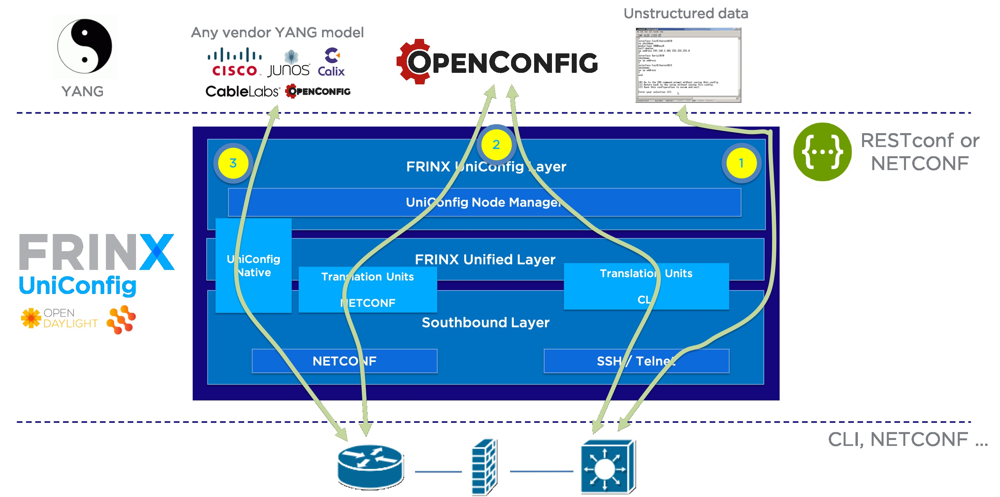

Getting started with FRINX UniConfig
====================================

This guide explains how to run the FRINX UniConfig for the first time.
Content:

* `System requirements <#system-requirements>`__
* `Download the FRINX UniConfig distribution <#download-the-frinx-uniconfig-distribution>`__
* `Activate your FRINX UniConfig distribution <#activate-your-frinx-uniconfig-distribution>`__
* `UniConfig basic principles <#uniconfig-basic-principles>`__
* `Install features <#install-features>`__

  * `Features for CLI <#features-for-cli>`__
  * `Features for NETCONF <#features-for-netconf>`__
  * `Features for UniConfig native <#features-for-uniconfig-native>`__

* `Connecting devices <#connecting-devices>`__

System requirements
-------------------

*  **RAM:** 8GB minimum; 16GB recommended
*  **Linux:** Supported  Linux distributions are Centos7, Ubuntu 16.04 and Ubuntu 18.04   
*  **Java:** FRINX distribution requires Java 8 (Openjdk 1.8.0-171 or newer)  
 
*Note: Unless stated otherwise, this documentation assumes you are using Linux.*  

**To install Java:**

CentOS: Run a terminal and insert a command below:

.. code-block:: guess

   $ sudo yum install java-1.8.0-openjdk

Ubuntu: Run a terminal and insert a command below:

.. code-block:: bash

   sudo apt-get install openjdk-8-jre

Download the FRINX UniConfig distribution
-----------------------------------------

Please click on the following link to download a zip archive of the latest Oxygen FRINX UniConfig distribution:

**Oxygen**: `distribution-karaf-4.2.0.frinx.zip <https://license.frinx.io/download/distribution-karaf-4.2.0.frinx.zip>`__

By downloading the file you accept the FRINX software agreement: `EULA <7793505-v7-Frinx-ODL-Distribution-Software-End-User-License-Agreement.pdf>`__

Activate your FRINX UniConfig distribution
------------------------------------------

To activate your installation, unzip the file and open the directory.
Enter the following commands in a terminal to start and activate FRINX UniConfig.  

**Note**: The token is unique to your user account on frinx.io and cannot be shared with other users.
It can be found `here <https://frinx.io/my-licenses-information>`__ (you need to be logged in frinx.io to view your token)

.. code-block:: guess

   ./bin/karaf frinx.createtoken [frinx-license_secret-token]

**Note**: In the event of copying the command shown above into the terminal, insert your unique token in place of [frinx-licence_secret-token]. Do not insert token number into the square brackets.

FRINX UniConfig needs approximately **3 minutes** to startup and shutdown.  

To maintain system integrity, please do not interrupt the startup by shutting down running processes within this time.  

In the event of interruption, the initial state can be restored by entering the following commands from a terminal within your FRINX UniConfig main directory.  

**First** command forcibly kills the FRINX UniConfig karaf process
**Second** command cleans certain directories:

.. code-block:: bash

   kill -9 $(pgrep  -o -f  karaf)
   rm  -rf  data/ snapshots/ journal/

To stop FRINX UniConfig safely from within the karaf console, hold the 'CTRL' key and press the 'D' key.
For more info on operating karaf, see :doc:`running-frinx-odl-after-activation`

For non-standard setups, use this guide :doc:`Operations_Manual/running-frinx-odl-initial`

UniConfig basic principles
--------------------------

The purpose of UniConfig is to manage the intent (desired configuration) of physical and virtual networking devices through a single network API. In addition, UniConfig enables device and network wide transactions so that the network will always remain in a well-defined state without leftovers from failed  configuration attempts. UniConfig is delivered as an application in the FRINXOpenDaylight (ODL) distribution and as a standalone application. UniConfig enables users to communicate with their network infrastructure via three different options:

1) Via unstructured data through CLI
2) Via OpenConfig API withthe help of our open source device library
3) Via vendor YANG models native to the connected devices

**Option 1)** gives users similar capabilities like access through Ansible or similar tools and allows to pass strings to the device and receive strings from the device in a programmatic way. UniConfig provides the mechanism to authenticate and provide a channel to send and receive data but does not interpret the data. That is left for the user application to do.

**Option 2)** provides users with an OpenConfig API that is translated into device specific CLI or YANG models. This requires “translation units” to be installed for the devices under control. FRINX provides an open source device library that includes many devices from widely deployed network vendors.

**Option 3)** also called “UniConfig native”, provides the ability to configure devices with any YANG model that is supported by the device. After mounting a device, UniConfig native maps the vendor models into its UniConfig data store and provides stateful configuration capabilities to applications and users.

Install features
----------------

Features for CLI
~~~~~~~~~~~~~~~~

Install the features necessary to use CLI with command below:

.. code-block:: guess

   frinx-user@root>feature:install cli-southbound-all-units odl-restconf odl-netconf-connector-all unified-topology-all-units frinx-installer-backend uniconfig-node-manager

Features for NETCONF
~~~~~~~~~~~~~~~~~~~~

Install the features necessary to use NETCONF with command below:

.. code-block:: guess

   frinx-user@root>feature:install odl-netconf-connector-all

Features for UniConfig native
~~~~~~~~~~~~~~~~~~~~~~~~~~~~~

Install the features necessary to use UniConfig-native with command below:

.. code-block:: guess

   frinx-user@root>feature:install frinx-UniConfig-native frinx-unified-topology odl-netconf-topology

Connecting devices
------------------

When using Karaf to run FRINX UniConfig, the address used for this operation is localhost:8181.
After FRINX UniConfig initiation, make sure, you can reach your device through the network.
Either using VPN or when the device is located in the same network as your workstation, use the IP address of the device.

After completing steps listed above, you can proceed to the :doc:`API` documentation and start to configure your devices through FRINX UniConfig.
